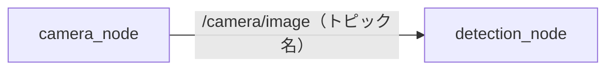
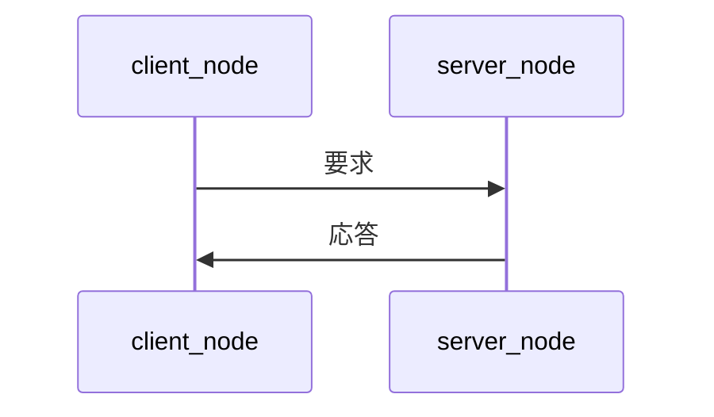
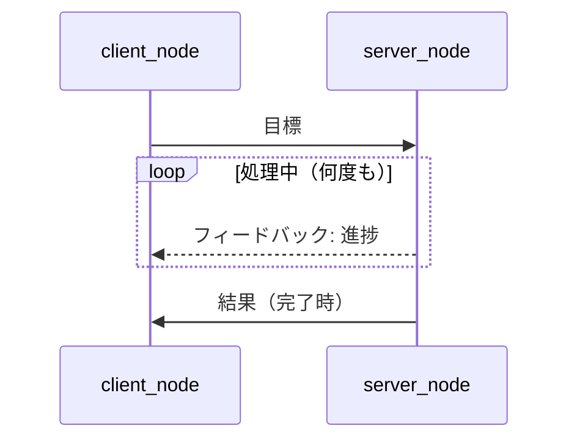
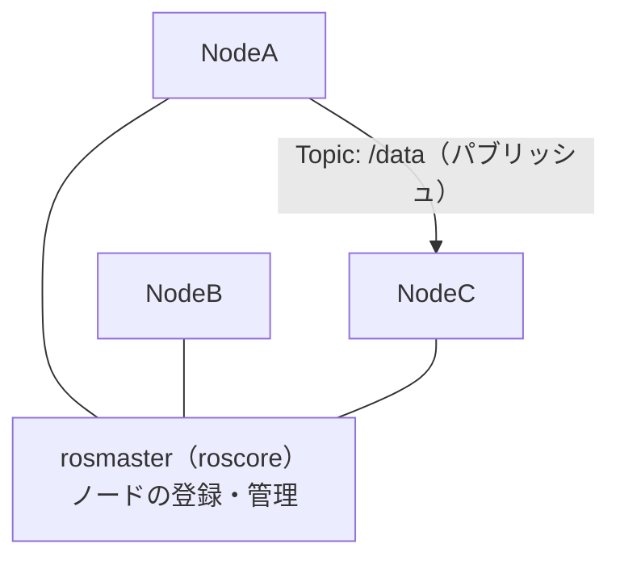

# 1章: ROS とは

## ROS の概要

**ROS（Robot Operating System）** は，ロボットソフトウェア開発のための「ミドルウェア」です．
OS という名前がついていますが，Windows や Linux のような OS ではなく，Linux の上で動作するソフトウェア基盤です．

### なぜ ROS を使うのか？

ロボットのソフトウェアには，カメラ・センサー・モーターなど，異なるハードウェアを連携させる必要があります．これを一から作ると非常に大変です．ROS を使うと：

- **部品化**：センサー処理・運動制御・認識などを独立したプログラムとして書ける
- **通信の仕組みが標準化**：部品間のデータ受け渡しが簡単に書ける
- **豊富なライブラリ**：カメラ・LiDAR・ロボットアームなどの既製部品が多数ある
- **可視化ツール**：`rviz`・`rqt` などのデバッグツールがある

### このチュートリアルで使う ROS バージョン

**ROS1 Noetic**（Ubuntu 20.04 向け）を使います．

---

## 基本概念

ROS を理解するうえで最初に押さえるべき 5 つの概念を説明します．

### ノード（Node）

**ノード = 1 つのプログラム（プロセス）** のことです．

ROS では 1 つの大きなプログラムを書くのではなく，小さなプログラム（ノード）をたくさん起動して，それらを連携させます．

```
例：
  camera_node      ← カメラ画像を取得するプログラム
  detection_node   ← 画像から物体を検出するプログラム
  motor_node       ← モーターを制御するプログラム
```

それぞれのノードは独立して動作し，お互いにデータを送り合います．

### トピック（Topic）

**トピック = データの流れ道（チャンネル）** のことです．

ノード同士はトピックを通じてデータをやり取りします．



- データを送る側を **Publisher（パブリッシャー）**
- データを受け取る側を **Subscriber（サブスクライバー）**

と呼びます．トピックを購読（subscribe）している全ノードにデータが届きます（放送のようなイメージ）．

### メッセージ（Message）

**メッセージ = トピックで流れるデータの型** のことです．

「文字列を送る」「センサー値（数値）を送る」「画像を送る」など，データの種類ごとにメッセージ型が決まっています．ROS には多くの標準メッセージ型が用意されています．

```
std_msgs/String     ← 文字列
std_msgs/Int32      ← 32bit 整数
std_msgs/Float64    ← 64bit 浮動小数点
sensor_msgs/Image   ← 画像
geometry_msgs/Twist ← 速度コマンド（ロボット移動に使う）
```

### サービス（Service）

**サービス = 要求・応答型の通信** のことです．

トピックは「送りっぱなし」ですが，サービスは「返事が欲しい」ときに使います．



例：「今の位置を教えて」→「現在地は (x=1.0, y=2.0) です」のような用途．

### アクション（Action）

**アクション = サービスを発展させた，長時間処理向けの通信** のことです．

目標地点への移動など，**完了まで時間がかかる処理**に使います．処理中に進捗（フィードバック）を受け取りながら，途中でキャンセルもできます．



詳しくは [6章: アクション通信](06_actionlib.md) で学びます．

### パラメータ（Parameter）

**パラメータ = プログラムの設定値** のことです．

ソースコードを書き直さずに，起動時に値を変えられる仕組みです．

```
例：
  センサーのサンプリング周波数
  ロボットの最大速度
  閾値・ゲイン値 など
```

---

## ROS の全体像



`roscore` はすべてのノードをつなぐ「交換機」の役割を担います．ROS を使うときは必ず最初に `roscore` を起動します．

---

## よく使うコマンドの一覧（参考）

実際の使い方は各章で説明します．ここでは「こういうコマンドがある」と把握しておくだけで大丈夫です．

| コマンド | 用途 |
|---------|------|
| `roscore` | ROS マスターの起動 |
| `rosrun <pkg> <node>` | ノードを起動する |
| `roslaunch <pkg> <file.launch>` | launch ファイルで複数ノードを起動 |
| `rosnode list` | 起動中のノード一覧 |
| `rostopic list` | 現在のトピック一覧 |
| `rostopic echo /topic_name` | トピックの内容をリアルタイム表示 |
| `rosmsg show <型名>` | メッセージ型の定義を確認 |
| `rosservice list` | 現在のサービス一覧 |
| `rosparam list` | 現在のパラメータ一覧 |

---

次の章では，実際に ROS をインストールして使える状態にします．

[→ 2章: 環境構築](02_setup.md)
