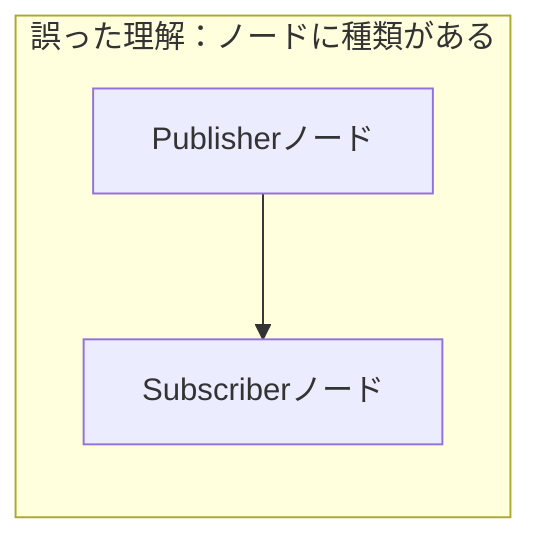
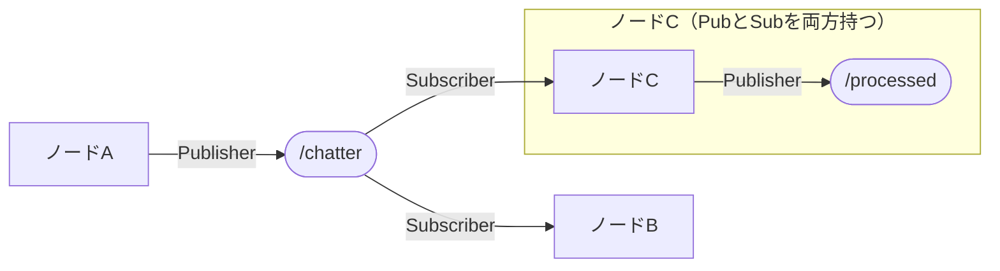
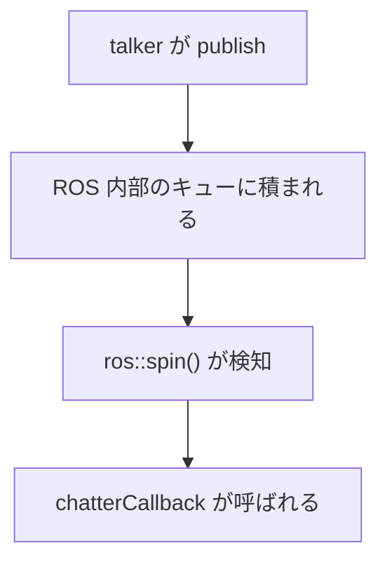
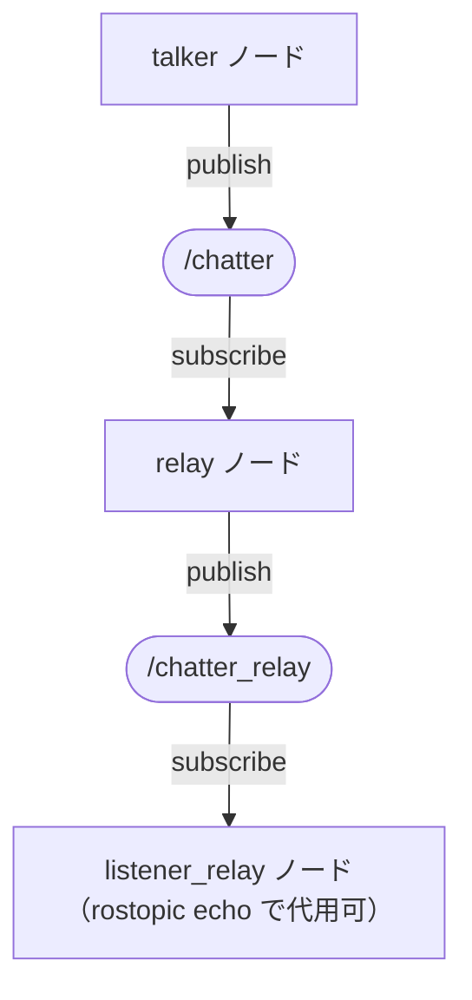

# 4章: Publisher / Subscriber

ROS の最も基本的な通信方式である **トピック通信** を実装します．

---

## トピック通信の仕組みを理解する

コードを書く前に，登場する概念を整理します．

### 4つの用語

| 用語 | 意味 |
|------|------|
| **ノード** | ROS 上で動くプログラムの単位 |
| **トピック** | メッセージをやり取りするための「名前付きチャンネル」 |
| **Publisher** | あるトピックにメッセージを**送る**インターフェース |
| **Subscriber** | あるトピックからメッセージを**受け取る**インターフェース |

### 重要：Publisher / Subscriber はノードの「種類」ではない

よくある誤解として，「Publisherノード」と「Subscriberノード」という2種類のノードがあると思われがちです．  
**これは正しくありません．**

Publisher と Subscriber は，**ノードがトピックに対して持つ接続の向き**です．  
1つのノードが Publisher と Subscriber の**両方**を同時に持つことができます．





「ノードがトピックに対して Publisher として登録する」  
「ノードがトピックに対して Subscriber として登録する」  
という言い方が正確です．

---

## この章でやること

1. `/chatter` トピックに文字列を送る **talker ノード**（Publisher を持つ）を作る
2. `/chatter` トピックから文字列を受け取る **listener ノード**（Subscriber を持つ）を作る
3. 2つのノードを起動して通信させる
4. Publisher と Subscriber の**両方**を持つ **relay ノード**を作る

---

## Publisher を持つノードを書く（talker.cpp）

`~/catkin_ws/src/ros_tutorial/src/talker.cpp` を作成します．

```cpp
#include <ros/ros.h>
#include <std_msgs/String.h>
#include <sstream>

int main(int argc, char **argv)
{
    // ROS ノードの初期化（必ず最初に呼ぶ）
    // 第3引数がノード名
    ros::init(argc, argv, "talker");

    // NodeHandle：ROS との通信窓口
    ros::NodeHandle nh;

    // Publisher の作成
    // "chatter" というトピック名で std_msgs::String 型のメッセージを送る
    // 第2引数はキューサイズ（送れなかったメッセージを何個まで保持するか）
    ros::Publisher pub = nh.advertise<std_msgs::String>("chatter", 10);

    // ループの周期を 10Hz に設定
    ros::Rate rate(10);

    int count = 0;
    while (ros::ok())   // roscore が生きている間はループ
    {
        // メッセージの作成
        std_msgs::String msg;
        std::stringstream ss;
        ss << "hello world " << count++;
        msg.data = ss.str();

        ROS_INFO("%s", msg.data.c_str());

        // メッセージの送信
        pub.publish(msg);

        ros::spinOnce();
        rate.sleep();
    }

    return 0;
}
```

### コードのポイント

| コード | 意味 |
|--------|------|
| `ros::init(argc, argv, "talker")` | ノードを "talker" という名前で ROS に登録 |
| `ros::NodeHandle nh` | ROS との通信に必要なオブジェクト（これを通じて Publisher / Subscriber を作る） |
| `nh.advertise<std_msgs::String>("chatter", 10)` | このノードが "chatter" トピックへの Publisher を持つことを登録 |
| `pub.publish(msg)` | メッセージを送信 |
| `ros::Rate rate(10)` / `rate.sleep()` | 10Hz を維持するためのタイマー |

---

## Subscriber を持つノードを書く（listener.cpp）

`~/catkin_ws/src/ros_tutorial/src/listener.cpp` を作成します．

```cpp
#include <ros/ros.h>
#include <std_msgs/String.h>

// コールバック関数：メッセージを受信したときに自動的に呼ばれる
void chatterCallback(const std_msgs::String::ConstPtr& msg)
{
    ROS_INFO("受信: [%s]", msg->data.c_str());
}

int main(int argc, char **argv)
{
    ros::init(argc, argv, "listener");
    ros::NodeHandle nh;

    // Subscriber の作成
    // "chatter" トピックを購読し，受信したら chatterCallback を呼ぶ
    ros::Subscriber sub = nh.subscribe("chatter", 10, chatterCallback);

    // spin()：コールバックが呼ばれるのを待ち続ける
    ros::spin();

    return 0;
}
```

### コールバック関数について

Subscriber はメッセージが届いたときに **コールバック関数** を自動で呼び出します．



コールバック引数の型 `std_msgs::String::ConstPtr` は「`std_msgs::String` 型メッセージへのポインタ」です．  
`msg->data` でメッセージの文字列にアクセスします（`.` ではなく `->` を使うのはポインタのためです）．

> `ConstPtr`・`->`・テンプレート `<>` などの記法がC++としてどういう意味かは，[付録: ROSのコードをC++として読む](appendix_ros_cpp.md) にまとめています．

---

## Publisher と Subscriber を両方持つノードを書く（relay.cpp）

talker と listener を見ると「Publisherのノード」「Subscriberのノード」という2種類があるように見えます．  
しかし実際のロボットシステムでは，**受け取りながら送る**ノードが頻繁に登場します．

`~/catkin_ws/src/ros_tutorial/src/relay.cpp` を作成します．

```cpp
#include <ros/ros.h>
#include <std_msgs/String.h>

ros::Publisher pub;  // コールバック内で使うためグローバルに置く

// /chatter を受信したら /chatter_relay に転送する
void relayCallback(const std_msgs::String::ConstPtr& msg)
{
    ROS_INFO("中継: [%s]", msg->data.c_str());
    pub.publish(*msg);  // publish() は参照で受け取るため，shared_ptr を * でデリファレンスして実体を渡す
}

int main(int argc, char **argv)
{
    ros::init(argc, argv, "relay");
    ros::NodeHandle nh;

    // 同じノードが Publisher と Subscriber の両方を持つ
    pub = nh.advertise<std_msgs::String>("chatter_relay", 10);
    ros::Subscriber sub = nh.subscribe("chatter", 10, relayCallback);

    ros::spin();

    return 0;
}
```

relay ノードは `/chatter` の Subscriber であり，`/chatter_relay` の Publisher でもあります．  
このように，**ノードの役割は Publisher か Subscriber かどちらか一方ではありません．**

通信の全体像はこうなります：



---

## CMakeLists.txt の更新

`~/catkin_ws/src/ros_tutorial/CMakeLists.txt` の末尾に追記します：

```cmake
add_executable(talker src/talker.cpp)
target_link_libraries(talker ${catkin_LIBRARIES})

add_executable(listener src/listener.cpp)
target_link_libraries(listener ${catkin_LIBRARIES})

add_executable(relay src/relay.cpp)
target_link_libraries(relay ${catkin_LIBRARIES})
```

---

## ビルドと実行

### ビルド

```bash
cd ~/catkin_ws
catkin build
```

### talker と listener の通信確認（ターミナル 3 つ）

**ターミナル 1：roscore**
```bash
roscore
```

**ターミナル 2：talker**
```bash
rosrun ros_tutorial talker
```

出力例：
```
[ INFO] [XXXX]: hello world 0
[ INFO] [XXXX]: hello world 1
```

**ターミナル 3：listener**
```bash
rosrun ros_tutorial listener
```

出力例：
```
[ INFO] [XXXX]: 受信: [hello world 0]
[ INFO] [XXXX]: 受信: [hello world 1]
```

### relay ノードの動作確認

talker を起動した状態で，別のターミナルで relay を起動します：

```bash
rosrun ros_tutorial relay
```

さらに別のターミナルで `/chatter_relay` の内容を確認します：

```bash
rostopic echo /chatter_relay
```

relay ノードが `/chatter` を受け取って `/chatter_relay` に流していることが確認できます．

---

## デバッグコマンドを試す

### ノード一覧の確認

```bash
rosnode list
```

出力例（talker・listener・relay をすべて起動している場合）：
```
/listener
/relay
/rosout
/talker
```

### トピック一覧の確認

```bash
rostopic list
```

出力例：
```
/chatter
/chatter_relay
/rosout
/rosout_agg
```

### トピックの内容をリアルタイムで確認

```bash
rostopic echo /chatter
```

### ノードとトピックの接続を可視化

```bash
rqt_graph
```

`rqt_graph` を使うと，どのノードがどのトピックに繋がっているか視覚的に確認できます．  
relay ノードが `/chatter` と `/chatter_relay` の両方に接続されていることがわかります．

### 送信レートの確認

```bash
rostopic hz /chatter
```

出力：
```
average rate: 10.000
```

---

## よくある疑問

### `spinOnce()` と `spin()` の違いは？

| 関数 | 動作 |
|------|------|
| `ros::spin()` | コールバックを待ち続ける（終了しない） |
| `ros::spinOnce()` | コールバックを 1 回だけ処理して即座に返る |

talker では自分でループを書くため `spinOnce()` を使い，listener や relay では待ち続けるだけでよいため `spin()` を使います．

### なぜ talker は `ros::spinOnce()` が必要なのか？

talker では Subscriber を使いませんが，ROS 内部の通信処理（接続管理など）のために必要です．  
ループ内には `ros::spinOnce()` を書く習慣をつけておきましょう．

### 1つのノードに Publisher や Subscriber はいくつでも作れる？

はい，何個でも作れます．実際のロボットシステムでは，1つのノードが複数のトピックを送受信することが普通です．  
例えばナビゲーションノードは「地図・センサ・目標位置」を受け取りながら「速度指令」を送ります．

---

[→ 5章: サービス](05_service.md)
