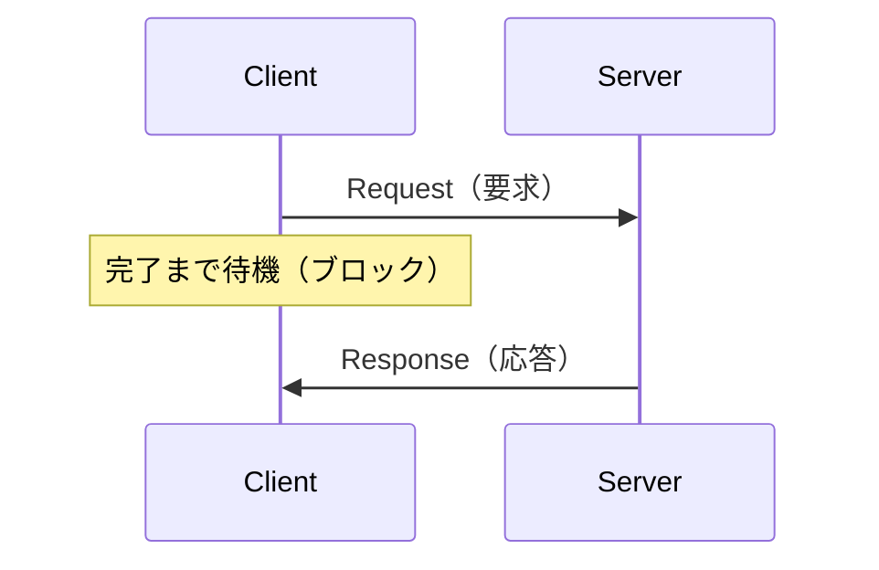

# 5章: サービス

ROS の通信方式には，前章で学んだ**トピック**のほかに**サービス**があります．

---

## トピックとサービスの違い

| 比較項目 | トピック | サービス |
|---------|---------|---------|
| 通信モデル | 非同期（送りっぱなし）| 同期（要求を送り，応答を受け取る）|
| 向き | 単方向（Publisher → Subscriber）| 双方向（Client ⇄ Server）|
| 主な用途 | センサーデータの連続配信 | 計算依頼・設定変更・一時的な操作 |
| 応答 | なし | あり |

**トピック**は「毎秒 10 回センサーデータを送り続ける」ような継続的な配信に向いています．  
**サービス**は「2つの数値を足してその結果を返す」「ロボットの設定を変更する」といった，**一回の要求に対して一回の応答を得る**用途に向いています．




---

## サービス定義ファイル（.srv）

サービスの型は `.srv` ファイルで定義します．`---` より上が**リクエスト**（クライアントが送る），下が**レスポンス**（サーバーが返す）です．

パッケージ内に `srv/` フォルダを作ります．

```bash
mkdir -p ~/catkin_ws/src/ros_tutorial/srv
```

`~/catkin_ws/src/ros_tutorial/srv/AddTwoInts.srv` を作成：

```
int64 a
int64 b
---
int64 sum
```

---

## ビルド設定の変更

### CMakeLists.txt の変更

#### 1. `find_package` に `message_generation` を追加

変更前：
```cmake
find_package(catkin REQUIRED COMPONENTS
  roscpp
  std_msgs
)
```

変更後：
```cmake
find_package(catkin REQUIRED COMPONENTS
  roscpp
  std_msgs
  message_generation
)
```

#### 2. `add_service_files` と `generate_messages` を追加（`catkin_package()` の前）

```cmake
add_service_files(
  FILES
  AddTwoInts.srv
)

generate_messages(
  DEPENDENCIES
  std_msgs
)
```

#### 3. `catkin_package` に `message_runtime` を追加

変更前：
```cmake
catkin_package()
```

変更後：
```cmake
catkin_package(
  CATKIN_DEPENDS roscpp std_msgs message_runtime
)
```

### package.xml の変更

`<buildtool_depend>catkin</buildtool_depend>` の下に追加：

```xml
<build_depend>message_generation</build_depend>
<exec_depend>message_runtime</exec_depend>
```

> **メモ**: `.msg` ファイルでカスタムメッセージを定義するときも同じ設定が必要です（詳しくは 7章）．

### 追加した設定の意味

`.srv` ファイルから C++ コードを生成するために，以下の4つの項目を追加しています：

| 項目 | タイミング | 役割 |
|------|-----------|------|
| `message_generation`（`find_package`） | コンパイル時 | `.srv` / `.msg` から C++ ヘッダを自動生成するツール |
| `add_service_files` | コンパイル時 | このパッケージのどの `.srv` ファイルを処理するかを宣言する |
| `generate_messages` | コンパイル時 | 宣言したファイルから実際に C++ ヘッダを生成する |
| `message_runtime`（`catkin_package` / `exec_depend`） | 実行時 | 生成されたメッセージ型を実行時に使えるようにする |

`message_generation` はビルド中だけ必要なので `build_depend`，`message_runtime` は実行時も必要なので `exec_depend` に書きます．

---

## サービスサーバーを実装する

`~/catkin_ws/src/ros_tutorial/src/add_two_ints_server.cpp` を作成：

```cpp
#include <ros/ros.h>
#include <ros_tutorial/AddTwoInts.h>

// コールバック：クライアントからリクエストが届いたとき呼ばれる
bool add(ros_tutorial::AddTwoInts::Request  &req,
         ros_tutorial::AddTwoInts::Response &res)
{
    res.sum = req.a + req.b;
    ROS_INFO("リクエスト: a=%ld, b=%ld → レスポンス: sum=%ld",
             req.a, req.b, res.sum);
    return true;  // true で成功，false で失敗
}

int main(int argc, char **argv)
{
    ros::init(argc, argv, "add_two_ints_server");
    ros::NodeHandle nh;

    // サービスを公開する．この変数が生きている間だけサービスが有効
    ros::ServiceServer service = nh.advertiseService("add_two_ints", add);
    ROS_INFO("add_two_ints サービスの準備完了");

    ros::spin();
    return 0;
}
```

### コードのポイント

| コード | 意味 |
|--------|------|
| `nh.advertiseService("add_two_ints", add)` | サービスを公開し，リクエストが来たら `add` を呼ぶよう登録する |
| `ros::ServiceServer service = ...` | 戻り値を変数に保持する必要がある．変数がスコープを抜けるとサービスが自動的に閉じる |
| コールバック引数 `Request &req` | クライアントから受け取った値（`.srv` の `---` より上のフィールド） |
| コールバック引数 `Response &res` | クライアントに返す値（`.srv` の `---` より下のフィールドをここに書き込む）|
| `return true` / `false` | サービス成功 / 失敗を示す．`false` を返すとクライアント側の `call()` も `false` を返す |

### コールバック引数と .srv の対応

`.srv` ファイルの構造がそのままコールバック引数に対応しています：

- `---` より上のフィールド（`a`, `b`）→ `req.a`, `req.b` から読む
- `---` より下のフィールド（`sum`）→ `res.sum` に書き込む

Subscriber のコールバックは `void` を返しますが，サービスのコールバックは `bool` を返して**成否をクライアントに伝える**点が異なります．

---

## サービスクライアントを実装する

`~/catkin_ws/src/ros_tutorial/src/add_two_ints_client.cpp` を作成：

```cpp
#include <ros/ros.h>
#include <ros_tutorial/AddTwoInts.h>
#include <cstdlib>

int main(int argc, char **argv)
{
    ros::init(argc, argv, "add_two_ints_client");

    if (argc != 3)
    {
        ROS_INFO("使い方: add_two_ints_client <a> <b>");
        return 1;
    }

    ros::NodeHandle nh;

    // サービスクライアントの作成
    ros::ServiceClient client =
        nh.serviceClient<ros_tutorial::AddTwoInts>("add_two_ints");

    // リクエストとレスポンスを1つにまとめたオブジェクト
    ros_tutorial::AddTwoInts srv;
    srv.request.a = std::atoll(argv[1]);   // リクエストに値をセット
    srv.request.b = std::atoll(argv[2]);

    // call() はブロッキング：レスポンスが返るまでこの行で止まる
    if (client.call(srv))
    {
        ROS_INFO("結果: %ld", srv.response.sum);   // call() の後に response を読む
    }
    else
    {
        ROS_ERROR("サービスの呼び出しに失敗しました");
        return 1;
    }

    return 0;
}
```

### コードのポイント

| コード | 意味 |
|--------|------|
| `nh.serviceClient<型>("名前")` | サービスクライアントを作る |
| `ros_tutorial::AddTwoInts srv` | リクエストとレスポンスを1つにまとめたオブジェクト．`srv.request` に値を入れ，`call()` 後に `srv.response` を読む |
| `srv.request.a = ...` | リクエストに値をセット（`call()` の前に行う）|
| `client.call(srv)` | サービスを呼び出す．完了したら `true`，サーバーが見つからない・失敗したら `false` を返す |
| `srv.response.sum` | レスポンスの値を読む（`call()` が `true` を返した後に有効）|

### `call()` はブロッキング

`client.call(srv)` を呼ぶと，サーバーがレスポンスを返すまでその行でプログラムが止まります．  
これが「同期通信」の意味です．即座に結果が返るサービスには問題ありませんが，**処理に時間がかかるサービスを呼ぶと，その間はほかの処理が一切できなくなります．**  
移動命令のような長時間処理にはアクション通信を使う理由がここにあります（[6章](06_actionlib.md)）．

---

## CMakeLists.txt に実行ファイルの設定を追加

`.srv` からヘッダファイルが自動生成されるため，そのヘッダを使うソースのコンパイル前に生成が完了するよう `add_dependencies` で順序を指定します．

| 引数 | 意味 |
|------|------|
| `${${PROJECT_NAME}_EXPORTED_TARGETS}` | このパッケージが `generate_messages` で生成するヘッダへの依存 |
| `${catkin_EXPORTED_TARGETS}` | `roscpp` など依存パッケージが生成するターゲットへの依存 |

カスタムメッセージ・サービス・アクションを**使わない**ノードには `add_dependencies` は不要です．

```cmake
add_executable(add_two_ints_server src/add_two_ints_server.cpp)
target_link_libraries(add_two_ints_server ${catkin_LIBRARIES})
add_dependencies(add_two_ints_server ${${PROJECT_NAME}_EXPORTED_TARGETS} ${catkin_EXPORTED_TARGETS})

add_executable(add_two_ints_client src/add_two_ints_client.cpp)
target_link_libraries(add_two_ints_client ${catkin_LIBRARIES})
add_dependencies(add_two_ints_client ${${PROJECT_NAME}_EXPORTED_TARGETS} ${catkin_EXPORTED_TARGETS})
```

---

## ビルドと実行

```bash
cd ~/catkin_ws
catkin build
```

**ターミナル 1：roscore**
```bash
roscore
```

**ターミナル 2：サーバーを起動**
```bash
rosrun ros_tutorial add_two_ints_server
```

出力：
```
[ INFO]: add_two_ints サービスの準備完了
```

**ターミナル 3：クライアントを実行**
```bash
rosrun ros_tutorial add_two_ints_client 3 7
```

クライアント側の出力：
```
[ INFO]: 結果: 10
```

サーバー側の出力：
```
[ INFO]: リクエスト: a=3, b=7 → レスポンス: sum=10
```

---

## rosservice コマンド

```bash
# 利用可能なサービス一覧
rosservice list

# サービスの詳細確認
rosservice info /add_two_ints

# サービスの型を確認
rosservice type /add_two_ints

# コマンドラインから直接呼び出す
rosservice call /add_two_ints "a: 10
b: 20"
```

サービス定義の確認：

```bash
rossrv show ros_tutorial/AddTwoInts
```

---

## トピックかサービスか

| 状況 | 使うべき通信 |
|------|------------|
| センサーデータを常に配信する | トピック |
| 速度指令を送り続ける | トピック |
| 計算して結果を返してほしい | サービス |
| 設定値を変更してほしい | サービス |
| 一度だけ特定の動作をしてほしい | サービス |

---

## 補足：第3の通信方式「アクション」

サービスは呼び出すと**完了まで待ち続ける**ため，移動命令のような長時間処理には不向きです．ROS にはこれを解決した **アクション通信（actionlib）** があります．

| | サービス | アクション |
|-|---------|----------|
| 処理中の進捗通知 | なし | あり（フィードバック）|
| 途中キャンセル | なし | あり |
| 向いている処理 | 即座に結果が返るもの | 完了まで時間がかかるもの |

次の [6章: アクション通信](06_actionlib.md) で実装方法を学びます．

---

[→ 6章: アクション通信](06_actionlib.md)
