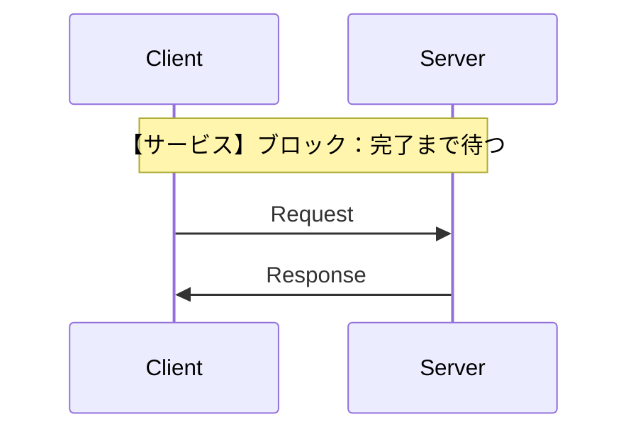
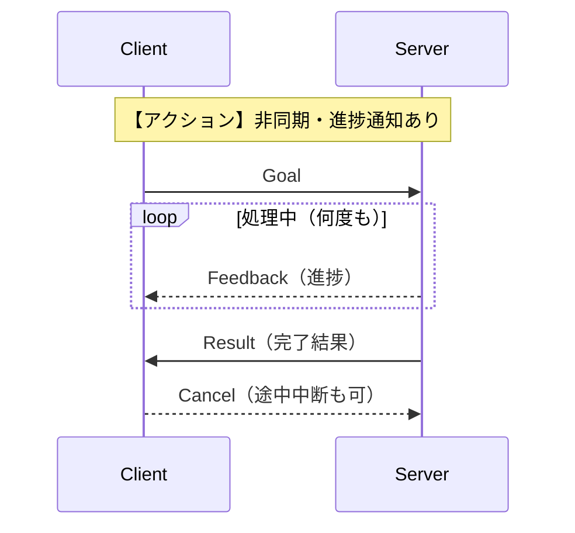

# 6章: アクション通信 ── actionlib

サービスは「呼び出したらすぐ結果が返ってくる」処理に向いていますが，**数秒〜数分かかる処理**には不向きです．**actionlib** は「進捗フィードバック」と「キャンセル」を備えた非同期通信を提供します．

---

## 3つの通信方式の比較

| 比較項目 | トピック | サービス | アクション |
|---------|---------|---------|----------|
| 通信モデル | 非同期（送りっぱなし）| 同期（完了まで待つ）| 非同期（進捗通知あり）|
| フィードバック | なし | なし | あり（処理中に随時通知）|
| キャンセル | なし | なし | あり |
| 主な用途 | センサーデータ配信 | 一時的な設定変更 | 移動・把持など長時間処理 |





---

## `.action` ファイルの定義

`.action` ファイルは **Goal / Result / Feedback** の 3 つのセクションを `---` で区切ります．

```bash
mkdir -p ~/catkin_ws/src/ros_tutorial/action
```

`~/catkin_ws/src/ros_tutorial/action/CountDown.action` を作成：

```
# Goal: カウントダウンの開始値
int32 target
---
# Result: 完了メッセージ
string message
---
# Feedback: 現在のカウント値
int32 remaining
```

ビルドすると自動的に以下の型が生成されます：

| 生成される型 | 内容 |
|------------|------|
| `ros_tutorial::CountDownGoal` | クライアントがサーバーに送る目標 |
| `ros_tutorial::CountDownResult` | サーバーが完了時に返す結果 |
| `ros_tutorial::CountDownFeedback` | サーバーが処理中に送る進捗 |
| `ros_tutorial::CountDownAction` | 上記3つをまとめた型（サーバー・クライアントの宣言に使う）|

---

## ビルド設定の変更

### CMakeLists.txt の変更

#### `find_package` に actionlib を追加

```cmake
find_package(catkin REQUIRED COMPONENTS
  roscpp
  std_msgs
  actionlib
  actionlib_msgs
  message_generation
)
```

| 追加パッケージ | 役割 |
|--------------|------|
| `actionlib` | Action Server / Client を実装するためのパッケージ |
| `actionlib_msgs` | Goal・Feedback・Result などアクション通信共通のメッセージ型 |
| `message_generation` | `.action` ファイルから C++ ヘッダを自動生成するツール（5章と同様）|

#### `add_action_files` と `generate_messages` を追加（`catkin_package()` の前）

```cmake
add_action_files(
  FILES
  CountDown.action
)

generate_messages(
  DEPENDENCIES
  std_msgs
  actionlib_msgs
)
```

#### `catkin_package` を更新

```cmake
catkin_package(
  CATKIN_DEPENDS roscpp std_msgs actionlib actionlib_msgs message_runtime
)
```

### package.xml の変更

```xml
<depend>actionlib</depend>
<depend>actionlib_msgs</depend>
```

---

## Action Server を実装する

`~/catkin_ws/src/ros_tutorial/src/count_down_server.cpp` を作成：

```cpp
#include <ros/ros.h>
#include <actionlib/server/simple_action_server.h>
#include <ros_tutorial/CountDownAction.h>
#include <boost/bind.hpp>

// 型名が長いので Server という別名をつける（typedef = 型の別名定義）
typedef actionlib::SimpleActionServer<ros_tutorial::CountDownAction> Server;

void executeCallback(const ros_tutorial::CountDownGoalConstPtr &goal,
                     Server *server)
{
    ros::Rate rate(1.0);
    ros_tutorial::CountDownFeedback feedback;
    ros_tutorial::CountDownResult   result;

    ROS_INFO("ゴール受信: target = %d", goal->target);

    for (int i = goal->target; i >= 0; --i)
    {
        if (server->isPreemptRequested() || !ros::ok())
        {
            ROS_INFO("キャンセルされました");
            server->setPreempted();
            return;
        }

        feedback.remaining = i;
        server->publishFeedback(feedback);
        ROS_INFO("残り: %d", i);

        rate.sleep();
    }

    result.message = "カウントダウン完了！";
    server->setSucceeded(result);
    ROS_INFO("完了");
}

int main(int argc, char **argv)
{
    ros::init(argc, argv, "count_down_server");
    ros::NodeHandle nh;

    // false = 自動起動しない．次行の server.start() で明示的に起動する
    Server server(nh, "count_down",
                  boost::bind(&executeCallback, _1, &server), false);
    server.start();   // ゴールの受け付けを開始する
    ROS_INFO("CountDown アクションサーバー準備完了");

    ros::spin();
    return 0;
}
```

### コードのポイント

| コード | 意味 |
|--------|------|
| `typedef ... Server` | 長い型名に `Server` という別名をつける |
| `Server server(nh, "count_down", ..., false)` | `false` は「自動起動しない」．次行の `server.start()` で明示的に起動する |
| `server.start()` | ゴールの受け付けを開始する |
| `boost::bind(&executeCallback, _1, &server)` | `executeCallback(goal, &server)` の形で呼ぶ関数を作る．`_1` はゴール（サーバーが自動で渡す）の受け取り場所 |
| `server->isPreemptRequested()` | クライアントからキャンセルリクエストが届いているか確認 |
| `server->publishFeedback(fb)` | 処理中に進捗をクライアントへ送る |
| `server->setSucceeded(result)` | 処理を成功として完了し，結果をクライアントに返す |
| `server->setPreempted()` | キャンセルリクエストを受け入れ，処理を中断する |

### `boost::bind` について

`SimpleActionServer` はゴールが届くと `executeCallback(goal)` の形（引数1つ）でコールバックを呼ぼうとします．  
しかし今回のコールバックは `executeCallback(goal, server)` と引数が2つあるため，そのままでは渡せません．  
`boost::bind(&executeCallback, _1, &server)` は「第1引数（`_1`）はサーバーが渡すゴール，第2引数は `&server` を固定して使う」という新しい関数を作る命令です．

---

## Action Client を実装する

`~/catkin_ws/src/ros_tutorial/src/count_down_client.cpp` を作成：

```cpp
#include <ros/ros.h>
#include <actionlib/client/simple_action_client.h>
#include <ros_tutorial/CountDownAction.h>

void feedbackCallback(
    const ros_tutorial::CountDownFeedbackConstPtr &feedback)
{
    ROS_INFO("フィードバック: 残り %d", feedback->remaining);
}

int main(int argc, char **argv)
{
    ros::init(argc, argv, "count_down_client");

    // true = 内部でスピンスレッドを自動起動（サーバー側の ros::spin() に相当）
    actionlib::SimpleActionClient<ros_tutorial::CountDownAction>
        client("count_down", true);

    ROS_INFO("サーバーの起動を待機中...");
    client.waitForServer();   // サーバーが準備完了するまでブロック

    ros_tutorial::CountDownGoal goal;
    goal.target = 5;

    ROS_INFO("ゴール送信: target = %d", goal.target);
    // sendGoal の引数順：ゴール，完了CB，アクティブCB，フィードバックCB
    client.sendGoal(goal,
                    NULL,    // 完了コールバック（使わないので NULL）
                    NULL,    // アクティブコールバック（使わないので NULL）
                    boost::bind(feedbackCallback, _1));   // フィードバックコールバック

    // 最大 30 秒間，完了を待つ．タイムアウトすると false が返る
    bool finished = client.waitForResult(ros::Duration(30.0));

    if (finished)
    {
        ROS_INFO("状態: %s", client.getState().toString().c_str());   // SUCCEEDED など
        ROS_INFO("結果: %s", client.getResult()->message.c_str());
    }
    else
    {
        ROS_WARN("タイムアウト：キャンセルを送信します");
        client.cancelGoal();
    }

    return 0;
}
```

### コードのポイント

| コード | 意味 |
|--------|------|
| `SimpleActionClient<型>("名前", true)` | クライアントを作る．`true` は「スピンスレッドを自動起動」（`ros::spin()` の呼び出しが不要になる）|
| `client.waitForServer()` | サーバーが起動するまでブロック（サーバーを先に `rosrun` しておく）|
| `client.sendGoal(goal, done_cb, active_cb, feedback_cb)` | ゴールを送信する．第2〜4引数はコールバック関数（不要な場合は `NULL`）|
| `client.waitForResult(ros::Duration(秒))` | 指定した秒数まで結果を待つ．完了したら `true`，タイムアウトなら `false` |
| `client.getState()` | 完了後の状態を取得（`SUCCEEDED`，`ABORTED`，`PREEMPTED` など）|
| `client.getResult()` | 完了後の結果（`CountDownResult` 型）を取得 |
| `client.cancelGoal()` | 進行中のゴールをキャンセルする |

---

## CMakeLists.txt に実行ファイルを追加

```cmake
add_executable(count_down_server src/count_down_server.cpp)
target_link_libraries(count_down_server ${catkin_LIBRARIES})
add_dependencies(count_down_server ${${PROJECT_NAME}_EXPORTED_TARGETS} ${catkin_EXPORTED_TARGETS})

add_executable(count_down_client src/count_down_client.cpp)
target_link_libraries(count_down_client ${catkin_LIBRARIES})
add_dependencies(count_down_client ${${PROJECT_NAME}_EXPORTED_TARGETS} ${catkin_EXPORTED_TARGETS})
```

---

## ビルドと実行

```bash
cd ~/catkin_ws
catkin build
source ~/catkin_ws/devel/setup.bash
```

**ターミナル 1：roscore**
```bash
roscore
```

**ターミナル 2：サーバーを起動**
```bash
rosrun ros_tutorial count_down_server
```

出力：
```
[ INFO]: CountDown アクションサーバー準備完了
```

**ターミナル 3：クライアントを実行**
```bash
rosrun ros_tutorial count_down_client
```

クライアント側の出力：
```
[ INFO]: サーバーの起動を待機中...
[ INFO]: ゴール送信: target = 5
[ INFO]: フィードバック: 残り 5
[ INFO]: フィードバック: 残り 4
[ INFO]: フィードバック: 残り 3
[ INFO]: フィードバック: 残り 2
[ INFO]: フィードバック: 残り 1
[ INFO]: フィードバック: 残り 0
[ INFO]: 状態: SUCCEEDED
[ INFO]: 結果: カウントダウン完了！
```

---

## キャンセルの動作確認

クライアントを実行してカウントダウンが始まったら，別ターミナルで：

```bash
rostopic pub /count_down/cancel actionlib_msgs/GoalID -- {}
```

サーバーが「キャンセルされました」を出力し，処理を中断することを確認できます．

---

## アクション関連コマンド

```bash
# アクションが使っているトピックを確認
rostopic list | grep count_down

# フィードバックを直接購読
rostopic echo /count_down/feedback
```

アクションは内部的に以下のトピックを自動生成します：

| トピック | 方向 | 内容 |
|---------|------|------|
| `/count_down/goal` | Client → Server | ゴール送信 |
| `/count_down/cancel` | Client → Server | キャンセル |
| `/count_down/status` | Server → Client | 現在の状態 |
| `/count_down/feedback` | Server → Client | 進捗 |
| `/count_down/result` | Server → Client | 完了結果 |

---

## トピック・サービス・アクションの使い分け

| 状況 | 使うべき通信 |
|------|------------|
| センサーデータを常に送り続ける | トピック |
| 計算して即座に結果を返す | サービス |
| 目標地点へ移動する（時間がかかる）| アクション |
| ロボットアームで物をつかむ | アクション |
| 途中キャンセルが必要な処理 | アクション |

> **14章で再び登場**：クラスを学んだあと，[14章: クラスを使った ROS プログラミング](14_ros_with_class.md) でこのサーバーをクラスで書き直した例を紹介します．

---

[→ 7章: カスタムメッセージ](07_custom_messages.md)
