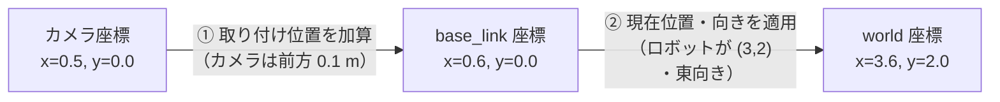
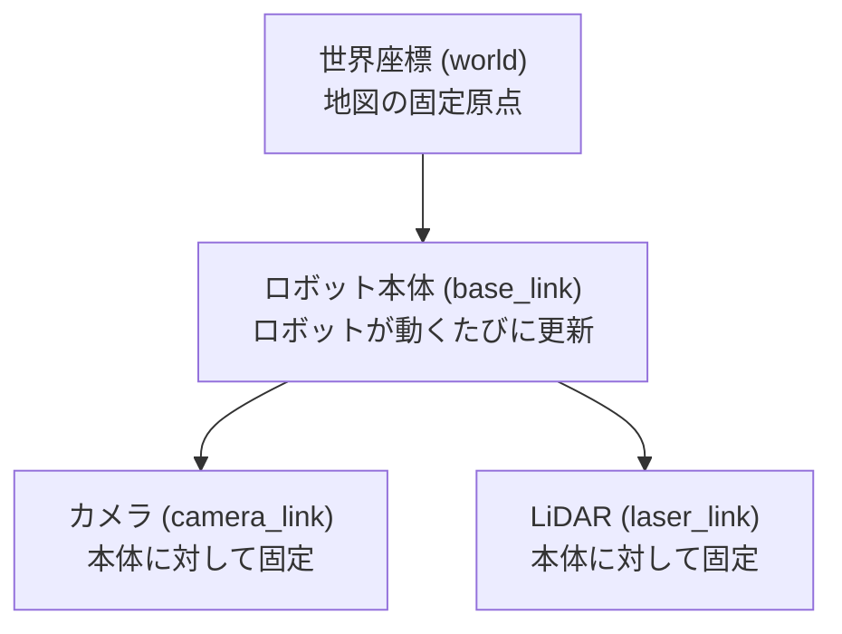
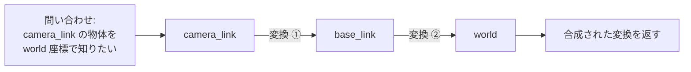
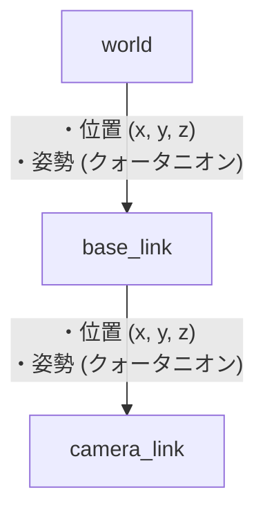

# 12章: tf / tf2 ── 座標変換

ロボットには「センサーの取り付け位置」「ロボット本体の向き」「地図上の位置」など，複数の「視点（座標系）」が同時に存在します．**tf2** はこれらの座標系間の変換を一元管理する ROS の標準ライブラリです．

---

## なぜ座標変換が必要か

次のような場面を考えてみてください．

**カメラがロボットの正面 0.5 m に物体を検出した．その物体は地図上のどこにあるか？**

直感的には簡単に思えますが，計算には複数の情報が必要です．

1. **カメラ → ロボット本体**：カメラはロボットのどこに，どんな向きで取り付けられているか
2. **ロボット本体 → 世界地図**：ロボット自体が地図のどこにいて，どちらを向いているか



これらを組み合わせて初めて「地図上の座標」が求まります．ロボットが動くたびに (2) は変化しますし，センサーの種類が増えるほど（LiDAR・カメラ・IMU…）この計算は複雑になります．

**tf2 はこの"座標系の連鎖"を自動で管理する仕組みです．**

---

## 座標フレームとは

**座標フレーム**（座標系）とは，「どこを原点にして，どの向きを基準にするか」を定めたものです．

同じ物体でも，どのフレームから見るかによって座標値が変わります．

```
【例】部屋の中にコップがある場合

  部屋の隅を原点にした場合：「東 2.0 m，北 1.5 m」
  テーブルの端を原点にした場合：「右 0.3 m，前 0.5 m」

  どちらも同じコップを指しているが，基準（フレーム）が違うと数値が変わる．
```

ロボットシステムでは，たとえば次のようなフレームが登場します：

| フレーム名 | 原点の位置 | 主な用途 |
|-----------|-----------|---------|
| `world` | 起動時に固定された地図原点 | ナビゲーション，地図全体 |
| `base_link` | ロボット本体の中心 | ロボット全体の制御 |
| `camera_link` | カメラの光学中心 | 画像認識，物体検出 |
| `laser_link` | LiDAR のスキャン中心 | 障害物検出，SLAM |



---

## TF が解決すること

### 各ノードは「自分の担当分だけ」配信する

センサードライバや SLAM などの各ノードは，**自分が担当するフレーム間の変換だけ** を配信します．

| 配信者 | 配信する変換 | 更新頻度 |
|--------|------------|---------|
| ナビゲーション / オドメトリ | `world → base_link` | ロボットが動くたび（高頻度） |
| ロボット記述 (URDF) | `base_link → camera_link` | 固定（起動時のみ） |
| ロボット記述 (URDF) | `base_link → laser_link` | 固定（起動時のみ） |

### TF が連鎖を自動計算する

tf2 はすべてのフレームをツリーとして管理し，誰でも任意の 2 フレーム間の変換を問い合わせられます．



ツリーを "たどる" ことで，直接の親子関係がないフレーム間の変換も自動計算できます．各ノードは全体の座標関係を知る必要がなく，**自分の担当分だけを配信・参照すればよい** のが tf2 の強みです．

---

## TF の内部通信

tf2 は内部的に ROS トピックを使って変換を管理しています．

| トピック | 型 | 用途 |
|---------|-----|------|
| `/tf` | `tf2_msgs/TFMessage` | 動的な変換（毎フレーム更新される変換） |
| `/tf_static` | `tf2_msgs/TFMessage` | 静的な変換（センサー取り付け位置など固定の変換） |

`rostopic echo /tf` を実行すると，変換データが流れているのを実際に確認できます．

```bash
rostopic echo /tf
```

```
transforms:
  -
    header:
      stamp: 1234567890.123
      frame_id: "world"
    child_frame_id: "base_link"
    transform:
      translation: {x: 0.97, y: 0.24, z: 0.0}
      rotation: {x: 0.0, y: 0.0, z: 0.71, w: 0.71}
```

### 通常のトピック通信との違い

| | 通常のトピック | `/tf` |
|---|---|---|
| メッセージ型 | 用途ごとに自由に選ぶ | `tf2_msgs/TFMessage` に固定 |
| Publisher / Subscriber の関係 | 基本は 1 対多 | **多対多**（複数の Broadcaster が同一トピックに書き込む） |
| データの蓄積 | Subscriber が受け取った時点のデータのみ | `Buffer` が一定時間分をキャッシュ |
| 静的変換 | 特になし | `/tf_static` は **latched topic**（一度配信すれば，後からSubscribeしたノードにも最新値が届く） |

通常トピックでは Publisher と Subscriber が 1 対多になるのが一般的ですが，`/tf` は**複数の Broadcaster が同一トピックに書き込む多対多の構造**です．`TransformListener` はその全データをまとめて受け取り，1 つの Buffer にツリーとして統合します．

---

## tf ツリー

フレーム間の関係は**木構造**（ツリー）で管理されます．各エッジが 1 つの変換（位置 + 姿勢）を表します．

> **木構造とは**
> 枝分かれする階層構造のことです．一番上の根（root）から始まり，下に向かって枝が伸びていきます．各ノード（節）は必ず 1 つの親を持ち（root を除く），ループ（循環）は存在しません．
> tf ツリーでは `world` が root，各フレームがノード，矢印（エッジ）が変換に対応します．



この章では `world → base_link` の変換を扱います．

ツリーを確認するコマンド：

```bash
# フレームツリーを PDF に出力
rosrun tf2_tools view_frames.py
evince frames.pdf

# 特定フレーム間の変換をリアルタイム確認
rosrun tf tf_echo world base_link
```

---

## TransformBroadcaster（フレームを配信する）

フレームの位置・姿勢を `geometry_msgs::TransformStamped` として配信します．

`~/catkin_ws/src/ros_tutorial/src/tf_broadcaster.cpp` を作成：

```cpp
#include <ros/ros.h>
#include <tf2_ros/transform_broadcaster.h>
#include <geometry_msgs/TransformStamped.h>
#include <tf2/LinearMath/Quaternion.h>
#include <cmath>

int main(int argc, char **argv)
{
    ros::init(argc, argv, "tf_broadcaster");
    ros::NodeHandle nh;

    tf2_ros::TransformBroadcaster br;
    ros::Rate rate(10);  // 10 Hz

    double t = 0.0;

    while (ros::ok())
    {
        geometry_msgs::TransformStamped ts;

        // ヘッダー：いつ・どの親フレームから子フレームへの変換か
        ts.header.stamp    = ros::Time::now();
        ts.header.frame_id = "world";      // 親フレーム
        ts.child_frame_id  = "base_link";  // 子フレーム

        // 位置：円運動（半径 1.0m）
        ts.transform.translation.x = std::cos(t);
        ts.transform.translation.y = std::sin(t);
        ts.transform.translation.z = 0.0;

        // 姿勢：進行方向を向く（yaw = t + 90°）
        tf2::Quaternion q;
        q.setRPY(0, 0, t + M_PI / 2.0);
        ts.transform.rotation.x = q.x();
        ts.transform.rotation.y = q.y();
        ts.transform.rotation.z = q.z();
        ts.transform.rotation.w = q.w();

        br.sendTransform(ts);

        t += 0.05;
        rate.sleep();
    }
    return 0;
}
```

### コードのポイント

| コード | 意味 |
|--------|------|
| `ts.header.frame_id` | 親フレーム（基準となる座標系）|
| `ts.child_frame_id` | 子フレーム（変換先の座標系）|
| `tf2::Quaternion` | 回転をクォータニオンで表現 |
| `q.setRPY(r, p, y)` | RPY（Roll・Pitch・Yaw）をクォータニオンに変換する |
| `br.sendTransform(ts)` | tf ツリーにフレームを配信 |

### 姿勢の表現：RPY とクォータニオン

3D 空間での姿勢（向き）は 3 つの回転で表せます：

| 名前 | 軸 | イメージ |
|------|----|---------|
| **Roll**（ロール） | X 軸まわり | 飛行機が左右に傾く動き |
| **Pitch**（ピッチ） | Y 軸まわり | 飛行機が機首を上下する動き |
| **Yaw**（ヨー） | Z 軸まわり | 飛行機が左右に旋回する動き |

地面を走るロボットではほとんどの場合 Roll・Pitch は 0 で，**Yaw だけがロボットの向き**を表します．

`q.setRPY(0, 0, t + M_PI/2.0)` は「Z 軸まわりに `t + 90°` だけ回転」を意味します．

**クォータニオンを使う理由**：RPY は人間にとって直感的ですが，複数の回転を合成する計算で数値的に不安定になることがあります．クォータニオン（4 次元のベクトル）はこの問題を回避した内部表現です．`setRPY` で直感的な角度を指定し，内部ではクォータニオンとして扱うのが一般的なパターンです．

---

## TransformListener（変換を受け取る）

`~/catkin_ws/src/ros_tutorial/src/tf_listener.cpp` を作成：

```cpp
#include <ros/ros.h>
#include <tf2_ros/transform_listener.h>
#include <geometry_msgs/TransformStamped.h>

int main(int argc, char **argv)
{
    ros::init(argc, argv, "tf_listener");
    ros::NodeHandle nh;

    tf2_ros::Buffer tfBuffer;
    tf2_ros::TransformListener tfListener(tfBuffer);

    ros::Rate rate(1.0);  // 1 Hz

    while (ros::ok())
    {
        geometry_msgs::TransformStamped ts;
        try
        {
            // "world" から "base_link" への最新の変換を取得
            ts = tfBuffer.lookupTransform("world", "base_link",
                                          ros::Time(0));  // 0 = 最新

            ROS_INFO("base_link の位置: x=%.2f, y=%.2f",
                     ts.transform.translation.x,
                     ts.transform.translation.y);
        }
        catch (tf2::TransformException &ex)
        {
            ROS_WARN("%s", ex.what());
        }

        rate.sleep();
    }
    return 0;
}
```

### コードのポイント

| コード | 意味 |
|--------|------|
| `tf2_ros::Buffer` | 変換を一定時間キャッシュする |
| `tf2_ros::TransformListener` | バッファへの自動受信を開始する |
| `lookupTransform(target, source, time)` | フレーム間の変換を取得する．第1引数が「変換後（結果を表したい）フレーム」，第2引数が「変換前（元データの）フレーム」 |
| `ros::Time(0)` | 「最新の変換でよい」を意味する特別な値．特定時刻の変換が必要な場合はその `ros::Time` を渡す |
| `TransformException` | フレームがまだ配信されていないなど，変換が失敗した場合に投げられる例外 |

`Buffer` と `TransformListener` はスコープが終わると受信も停止するため，**ノードが動いている間ずっと生存させる**必要があります．

### `try/catch` が必要な理由

`lookupTransform` はフレームがまだ存在しない場合（Broadcaster が起動した直後など）に例外を投げます．  
例外を受け取らずに放置するとノードがクラッシュするため，`ROS_WARN` で警告を出してループを継続する書き方が基本パターンです．

```
引数の順番の覚え方：「world から見た base_link を取得」
→ lookupTransform("world", "base_link", ...)
→ 「どこで見る（target）」「何を見る（source）」の順
```

---

## ビルド設定

### CMakeLists.txt の変更

#### `find_package` に tf2 関連パッケージを追加

```cmake
find_package(catkin REQUIRED COMPONENTS
  roscpp
  std_msgs
  geometry_msgs
  tf2
  tf2_ros
)
```

| 追加パッケージ | 役割 |
|--------------|------|
| `geometry_msgs` | `TransformStamped`・`Point`・`Pose` などの幾何学メッセージ型 |
| `tf2` | 座標変換のコアライブラリ（`Quaternion` の計算など）|
| `tf2_ros` | ROS との統合（`TransformBroadcaster`・`TransformListener` など）|

#### 実行ファイルを追加

```cmake
add_executable(tf_broadcaster src/tf_broadcaster.cpp)
target_link_libraries(tf_broadcaster ${catkin_LIBRARIES})

add_executable(tf_listener src/tf_listener.cpp)
target_link_libraries(tf_listener ${catkin_LIBRARIES})
```

### package.xml の変更

```xml
<depend>tf2</depend>
<depend>tf2_ros</depend>
<depend>geometry_msgs</depend>
```

---

## ビルドと実行

```bash
cd ~/catkin_ws
catkin build
source ~/catkin_ws/devel/setup.bash
```

**ターミナル 1：roscore**
```bash
roscore
```

**ターミナル 2：Broadcaster を起動**
```bash
rosrun ros_tutorial tf_broadcaster
```

**ターミナル 3：Listener を起動**
```bash
rosrun ros_tutorial tf_listener
```

出力例：
```
[ INFO]: base_link の位置: x=1.00, y=0.05
[ INFO]: base_link の位置: x=0.97, y=0.24
[ INFO]: base_link の位置: x=0.88, y=0.48
```

---

## RViz での確認

RViz を起動して TF フレームを視覚化できます．

```bash
rviz
```

1. 左パネルの **「Add」** ボタンをクリック
2. **「TF」** を選択して **「OK」**
3. 左上の Global Options の「Fixed Frame」を `world` に設定

`base_link` フレームが `world` フレームを中心に円を描くように動くのが確認できます．

---

## 静的変換（Static Transform）

センサーの取り付け位置など，**変化しない変換**には `static_transform_publisher` を使います．

```bash
# 書式: static_transform_publisher x y z yaw pitch roll frame_id child_frame_id period_ms
rosrun tf static_transform_publisher 0.1 0 0.2 0 0 0 base_link camera_link 100
```

launch ファイルでの書き方：

```xml
<node pkg="tf" type="static_transform_publisher" name="camera_tf"
      args="0.1 0 0.2  0 0 0  base_link camera_link 100" />
```

---

## tf 関連コマンドまとめ

```bash
# フレーム一覧と接続状況を表示
rosrun tf tf_monitor

# 特定フレーム間の変換を表示し続ける
rosrun tf tf_echo world base_link

# フレームツリーを PDF に出力
rosrun tf2_tools view_frames.py
evince frames.pdf
```

---

## 実機ロボットとの関係

ロボットのドライバを起動すると，オドメトリから自動的に `odom → base_footprint` などの TF が配信されます．RViz の TF ディスプレイを使うと，ロボットの動きに合わせて座標フレームが更新されるのをリアルタイムで確認できます（16章以降の Kobuki 演習で体験できます）．

---

[→ 13章: C++ クラス入門](13_cpp_class_basics.md)
