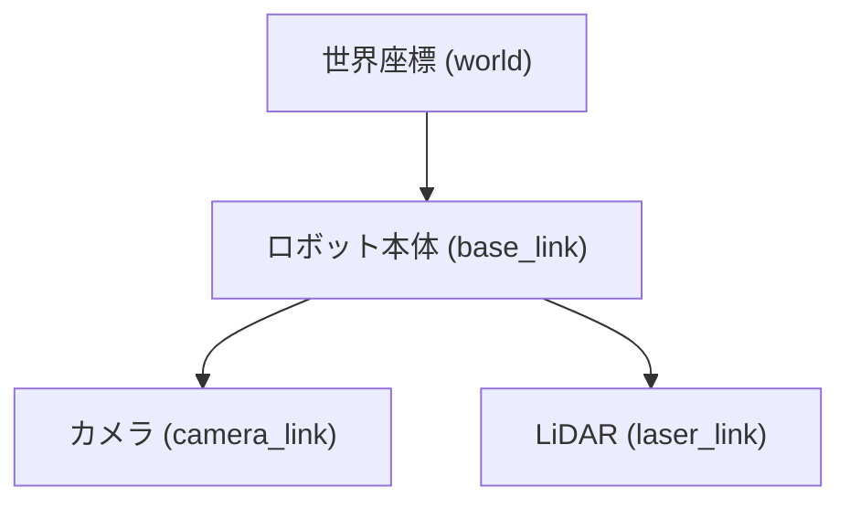
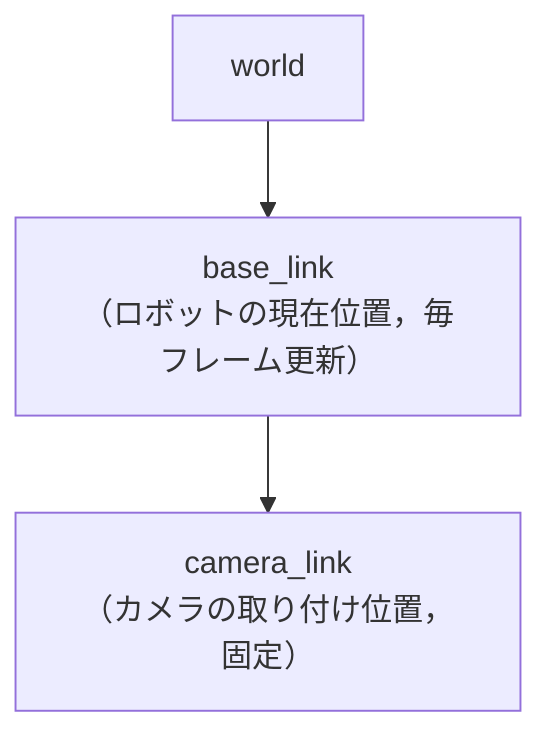

# 12章: tf / tf2 ── 座標変換

ロボットには「ボディ中心」「センサー取り付け位置」「世界座標」など，複数の座標フレームが登場します．**tf2** はこれらのフレーム間の変換を管理する ROS の標準ライブラリです．

---

## 座標フレームとは

ロボットシステムでは複数の「視点（座標系）」が共存します．



「カメラが見た障害物は世界座標のどこにあるか？」── この変換を扱うのが tf2 です．

---

## tf ツリー

フレーム間の関係は**木構造**（ツリー）で管理されます．各エッジが 1 つの変換（位置 + 姿勢）を表します．



ツリーを確認するコマンド：

```bash
# フレームツリーを PDF に出力
rosrun tf2_tools view_frames.py
evince frames.pdf

# 特定フレーム間の変換をリアルタイム確認
rosrun tf tf_echo world base_link
```

---

## TransformBroadcaster（フレームを配信する）

フレームの位置・姿勢を `geometry_msgs::TransformStamped` として配信します．

`~/catkin_ws/src/ros_tutorial/src/tf_broadcaster.cpp` を作成：

```cpp
#include <ros/ros.h>
#include <tf2_ros/transform_broadcaster.h>
#include <geometry_msgs/TransformStamped.h>
#include <tf2/LinearMath/Quaternion.h>
#include <cmath>

int main(int argc, char **argv)
{
    ros::init(argc, argv, "tf_broadcaster");
    ros::NodeHandle nh;

    tf2_ros::TransformBroadcaster br;
    ros::Rate rate(10);  // 10 Hz

    double t = 0.0;

    while (ros::ok())
    {
        geometry_msgs::TransformStamped ts;

        // ヘッダー：いつ・どの親フレームから子フレームへの変換か
        ts.header.stamp    = ros::Time::now();
        ts.header.frame_id = "world";      // 親フレーム
        ts.child_frame_id  = "base_link";  // 子フレーム

        // 位置：円運動（半径 1.0m）
        ts.transform.translation.x = std::cos(t);
        ts.transform.translation.y = std::sin(t);
        ts.transform.translation.z = 0.0;

        // 姿勢：進行方向を向く（yaw = t + 90°）
        tf2::Quaternion q;
        q.setRPY(0, 0, t + M_PI / 2.0);
        ts.transform.rotation.x = q.x();
        ts.transform.rotation.y = q.y();
        ts.transform.rotation.z = q.z();
        ts.transform.rotation.w = q.w();

        br.sendTransform(ts);

        t += 0.05;
        rate.sleep();
    }
    return 0;
}
```

### コードのポイント

| コード | 意味 |
|--------|------|
| `ts.header.frame_id` | 親フレーム（基準となる座標系）|
| `ts.child_frame_id` | 子フレーム（変換先の座標系）|
| `tf2::Quaternion` | 回転をクォータニオンで表現 |
| `q.setRPY(r, p, y)` | RPY（Roll=X軸・Pitch=Y軸・Yaw=Z軸まわりの回転角，単位 rad）をクォータニオンに変換する |
| `br.sendTransform(ts)` | tf ツリーにフレームを配信 |

---

## TransformListener（変換を受け取る）

`~/catkin_ws/src/ros_tutorial/src/tf_listener.cpp` を作成：

```cpp
#include <ros/ros.h>
#include <tf2_ros/transform_listener.h>
#include <geometry_msgs/TransformStamped.h>

int main(int argc, char **argv)
{
    ros::init(argc, argv, "tf_listener");
    ros::NodeHandle nh;

    tf2_ros::Buffer tfBuffer;
    tf2_ros::TransformListener tfListener(tfBuffer);

    ros::Rate rate(1.0);  // 1 Hz

    while (ros::ok())
    {
        geometry_msgs::TransformStamped ts;
        try
        {
            // "world" から "base_link" への最新の変換を取得
            ts = tfBuffer.lookupTransform("world", "base_link",
                                          ros::Time(0));  // 0 = 最新

            ROS_INFO("base_link の位置: x=%.2f, y=%.2f",
                     ts.transform.translation.x,
                     ts.transform.translation.y);
        }
        catch (tf2::TransformException &ex)
        {
            ROS_WARN("%s", ex.what());
        }

        rate.sleep();
    }
    return 0;
}
```

### コードのポイント

| コード | 意味 |
|--------|------|
| `tf2_ros::Buffer` | 変換を一定時間キャッシュする |
| `tf2_ros::TransformListener` | バッファへの自動受信を開始する |
| `lookupTransform(target, source, time)` | フレーム間の変換を取得する．第1引数が「変換後（結果を表したい）フレーム」，第2引数が「変換前（元データの）フレーム」 |
| `ros::Time(0)` | 「最新の変換でよい」を意味する特別な値．特定時刻の変換が必要な場合はその `ros::Time` を渡す |
| `TransformException` | フレームがまだ配信されていないなど，変換が失敗した場合に投げられる例外 |

`Buffer` と `TransformListener` はスコープが終わると受信も停止するため，**ノードが動いている間ずっと生存させる**必要があります．

### `try/catch` が必要な理由

`lookupTransform` はフレームがまだ存在しない場合（Broadcaster が起動した直後など）に例外を投げます．  
例外を受け取らずに放置するとノードがクラッシュするため，`ROS_WARN` で警告を出してループを継続する書き方が基本パターンです．

```
引数の順番の覚え方：「world から見た base_link を取得」
→ lookupTransform("world", "base_link", ...)
→ 「どこで見る（target）」「何を見る（source）」の順
```

---

## ビルド設定

### CMakeLists.txt の変更

#### `find_package` に tf2 関連パッケージを追加

```cmake
find_package(catkin REQUIRED COMPONENTS
  roscpp
  std_msgs
  geometry_msgs
  tf2
  tf2_ros
)
```

| 追加パッケージ | 役割 |
|--------------|------|
| `geometry_msgs` | `TransformStamped`・`Point`・`Pose` などの幾何学メッセージ型 |
| `tf2` | 座標変換のコアライブラリ（`Quaternion` の計算など）|
| `tf2_ros` | ROS との統合（`TransformBroadcaster`・`TransformListener` など）|

#### 実行ファイルを追加

```cmake
add_executable(tf_broadcaster src/tf_broadcaster.cpp)
target_link_libraries(tf_broadcaster ${catkin_LIBRARIES})

add_executable(tf_listener src/tf_listener.cpp)
target_link_libraries(tf_listener ${catkin_LIBRARIES})
```

### package.xml の変更

```xml
<depend>tf2</depend>
<depend>tf2_ros</depend>
<depend>geometry_msgs</depend>
```

---

## ビルドと実行

```bash
cd ~/catkin_ws
catkin build
source ~/catkin_ws/devel/setup.bash
```

**ターミナル 1：roscore**
```bash
roscore
```

**ターミナル 2：Broadcaster を起動**
```bash
rosrun ros_tutorial tf_broadcaster
```

**ターミナル 3：Listener を起動**
```bash
rosrun ros_tutorial tf_listener
```

出力例：
```
[ INFO]: base_link の位置: x=1.00, y=0.05
[ INFO]: base_link の位置: x=0.97, y=0.24
[ INFO]: base_link の位置: x=0.88, y=0.48
```

---

## RViz での確認

RViz を起動して TF フレームを視覚化できます．

```bash
rviz
```

1. 左パネルの **「Add」** ボタンをクリック
2. **「TF」** を選択して **「OK」**
3. 左上の Global Options の「Fixed Frame」を `world` に設定

`base_link` フレームが `world` フレームを中心に円を描くように動くのが確認できます．

---

## 静的変換（Static Transform）

センサーの取り付け位置など，**変化しない変換**には `static_transform_publisher` を使います．

```bash
# 書式: static_transform_publisher x y z yaw pitch roll frame_id child_frame_id period_ms
rosrun tf static_transform_publisher 0.1 0 0.2 0 0 0 base_link camera_link 100
```

launch ファイルでの書き方：

```xml
<node pkg="tf" type="static_transform_publisher" name="camera_tf"
      args="0.1 0 0.2  0 0 0  base_link camera_link 100" />
```

---

## tf 関連コマンドまとめ

```bash
# フレーム一覧と接続状況を表示
rosrun tf tf_monitor

# 特定フレーム間の変換を表示し続ける
rosrun tf tf_echo world base_link

# フレームツリーを PDF に出力
rosrun tf2_tools view_frames.py
evince frames.pdf
```

---

## 実機ロボットとの関係

ロボットのドライバを起動すると，オドメトリから自動的に `odom → base_footprint` などの TF が配信されます．RViz の TF ディスプレイを使うと，ロボットの動きに合わせて座標フレームが更新されるのをリアルタイムで確認できます（15章以降の演習で体験できます）．

---

[→ 13章: C++ クラス入門](13_cpp_class_basics.md)
