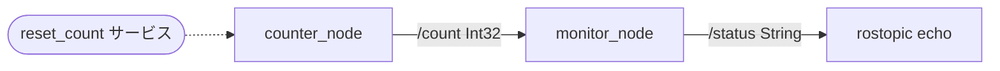
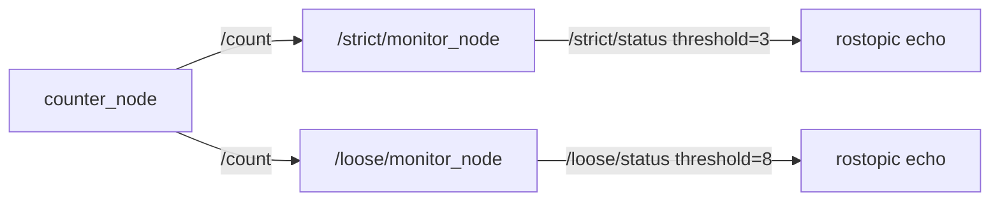
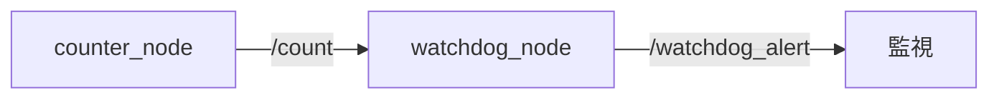

# 15章: ROS 総合演習 ── マルチノードシステムを組み立てる

1〜14章で学んだ個別の概念を**組み合わせて**動く小さなシステムを作ります．

---

## この章で作るもの

カウントアップしながら閾値を監視する 2 ノードシステムです．



| ノード | 役割 |
|--------|------|
| `counter_node` | 整数をカウントアップして `/count` に publish |
| `monitor_node` | `/count` を受け取り，閾値を超えたら `/status` に警告を publish |

使用する概念：

| 章 | 概念 |
|----|------|
| 4章 | Publisher / Subscriber |
| 5章 | サービス |
| 8章 | パラメータ |
| 9章 | launch ファイル |
| 14章 | クラスを使ったノード |

---

## パッケージの準備

1〜14章で作った `ros_tutorial` パッケージはそのまま残し，この章専用の新しいパッケージを作成します．

```bash
cd ~/catkin_ws/src
catkin create pkg ros_exercises --catkin-deps roscpp std_msgs std_srvs
```

一度ビルドしておきます：

```bash
cd ~/catkin_ws && catkin build
source devel/setup.bash
```

---

## CounterNode を作る

### 仕様

- `/count` に `std_msgs/Int32` を一定周期で publish
- サービス `reset_count`（`std_srvs/Empty`）でカウントを 0 にリセット
- パラメータ `rate` でパブリッシュ周波数を変更できる（デフォルト: 1.0 Hz）

`~/catkin_ws/src/ros_exercises/src/counter_node.cpp` を作成：

```cpp
#include <ros/ros.h>
#include <std_msgs/Int32.h>
#include <std_srvs/Empty.h>

class CounterNode
{
public:
    CounterNode() : count_(0)
    {
        // プライベートパラメータを取得（デフォルト: 1.0 Hz）
        ros::NodeHandle pnh("~");
        double rate;
        pnh.param("rate", rate, 1.0);

        pub_   = nh_.advertise<std_msgs::Int32>("count", 10);
        srv_   = nh_.advertiseService("reset_count",
                                      &CounterNode::resetCallback, this);
        timer_ = nh_.createTimer(ros::Duration(1.0 / rate),
                                  &CounterNode::timerCallback, this);

        ROS_INFO("CounterNode 起動 (rate=%.1f Hz)", rate);
    }

    void run() { ros::spin(); }

private:
    void timerCallback(const ros::TimerEvent&)
    {
        std_msgs::Int32 msg;
        msg.data = count_++;
        pub_.publish(msg);
        ROS_INFO("count: %d", msg.data);
    }

    bool resetCallback(std_srvs::Empty::Request&,
                       std_srvs::Empty::Response&)
    {
        ROS_INFO("カウントをリセット");
        count_ = 0;
        return true;
    }

    ros::NodeHandle    nh_;
    ros::Publisher     pub_;
    ros::ServiceServer srv_;
    ros::Timer         timer_;
    int                count_;
};

int main(int argc, char** argv)
{
    ros::init(argc, argv, "counter_node");
    CounterNode node;
    node.run();
    return 0;
}
```

### ポイント

- `std_srvs/Empty` はリクエスト・レスポンスともに空のサービス型です．データを渡す必要がない操作（リセット・開始・停止など）に使います．
- `ros::NodeHandle pnh("~")` は**プライベート NodeHandle**（8章で扱ったプライベートパラメータと対応します）
- Publisher・ServiceServer・Timer をすべてメンバ変数として保持する → 14章のパターン

---

## MonitorNode を作る

### 仕様

- `/count` を subscribe
- 受け取った値を `/status`（`std_msgs/String`）に publish
  - 閾値未満 → `"Normal: <値>"`
  - 閾値以上 → `"[ALERT] count reached <値>!"`
- パラメータ `threshold` で閾値を設定（デフォルト: 5）

`~/catkin_ws/src/ros_exercises/src/monitor_node.cpp` を作成：

```cpp
#include <ros/ros.h>
#include <std_msgs/Int32.h>
#include <std_msgs/String.h>

class MonitorNode
{
public:
    MonitorNode()
    {
        ros::NodeHandle pnh("~");
        pnh.param("threshold", threshold_, 5);

        sub_ = nh_.subscribe("count",  10, &MonitorNode::countCallback, this);
        pub_ = nh_.advertise<std_msgs::String>("status", 10);

        ROS_INFO("MonitorNode 起動 (threshold=%d)", threshold_);
    }

    void run() { ros::spin(); }

private:
    void countCallback(const std_msgs::Int32::ConstPtr& msg)
    {
        std_msgs::String status;

        if (msg->data >= threshold_)
        {
            status.data = "[ALERT] count reached " + std::to_string(msg->data) + "!";
            ROS_WARN("%s", status.data.c_str());
        }
        else
        {
            status.data = "Normal: " + std::to_string(msg->data);
            ROS_INFO("%s", status.data.c_str());
        }

        pub_.publish(status);
    }

    ros::NodeHandle nh_;
    ros::Subscriber sub_;
    ros::Publisher  pub_;
    int             threshold_;
};

int main(int argc, char** argv)
{
    ros::init(argc, argv, "monitor_node");
    MonitorNode node;
    node.run();
    return 0;
}
```

---

## CMakeLists.txt に追加

```cmake
add_executable(counter_node src/counter_node.cpp)
target_link_libraries(counter_node ${catkin_LIBRARIES})

add_executable(monitor_node src/monitor_node.cpp)
target_link_libraries(monitor_node ${catkin_LIBRARIES})
```

---

## 個別に動かして確認する

```bash
cd ~/catkin_ws && catkin build
```

**ターミナル 1：**
```bash
roscore
```

**ターミナル 2：**
```bash
rosrun ros_exercises counter_node _rate:=1.0
```

**ターミナル 3：**
```bash
rosrun ros_exercises monitor_node _threshold:=5
```

**ターミナル 4（確認用）：**
```bash
rostopic echo /status
```

カウントが 5 に達すると MonitorNode が `[ALERT]` を出力します．

**リセットを試す：**
```bash
rosservice call /reset_count
```

---

## launch ファイルでまとめて起動

`~/catkin_ws/src/ros_exercises/launch/monitor_system.launch` を作成：

```xml
<launch>
  <node pkg="ros_exercises" type="counter_node" name="counter_node" output="screen">
    <param name="rate"      value="2.0"/>
  </node>

  <node pkg="ros_exercises" type="monitor_node" name="monitor_node" output="screen">
    <param name="threshold" value="8"/>
  </node>
</launch>
```

```bash
roslaunch ros_exercises monitor_system.launch
```

2 Hz でカウントアップし，8 に達すると警告が表示されます．

---

## 演習

### 演習 1: 最大値で自動停止

CounterNode に「カウントが `max_count` に達したら自動的にノードを終了する」機能を追加してください．

```bash
# max_count=10 で起動（10 カウント後に終了）
rosrun ros_exercises counter_node _max_count:=10
```

**ヒント：**
- `pnh.param("max_count", max_count_, 10)` でパラメータ取得
- `timerCallback` 内で `count_` が `max_count_` を超えたら `ros::shutdown()` を呼ぶ

<details>
<summary>サンプルコード（考えてから開くこと！）</summary>

`timerCallback` に以下を追加：

```cpp
if (count_ > max_count_)
{
    ROS_INFO("max_count (%d) に達しました．終了します", max_count_);
    ros::shutdown();
    return;
}
```

コンストラクタで `pnh.param("max_count", max_count_, 10);` を追加し，メンバ変数 `int max_count_` も宣言してください．

</details>

---

### 演習 2: rosbag で記録して再生

動作中のシステムを rosbag で記録し，再生してみましょう（11章の復習）．

```bash
# システムを起動した状態で別ターミナルから記録開始
rosbag record /count /status -O monitor_system.bag

# しばらく動かしてから Ctrl-C で停止

# roscore だけ残してノードを停止し，bag を再生
rosbag play monitor_system.bag
```

`rostopic echo /status` で記録した /status が再生されていることを確認してください．

---

### 演習 3: カスタムメッセージでステータスを拡張する

MonitorNode が publish するステータスを `std_msgs/String` から**カスタムメッセージ**に置き換えてください（7章の復習）．

#### カスタムメッセージの定義

`~/catkin_ws/src/ros_exercises/msg/CounterStatus.msg` を作成：

```
int32   value         # カウント値
bool    is_alert      # 閾値超えのとき true
float64 elapsed_time  # カウント開始からの経過秒数
```

#### 変更点

MonitorNode を以下のように変更します：

- `pub_` が publish する型を `ros_exercises::CounterStatus` に変更
- `start_time_`（`ros::Time`）をコンストラクタで `ros::Time::now()` に初期化し，メンバ変数として保持
- `countCallback` 内で `CounterStatus` を組み立てて publish

#### 動作確認

```bash
rostopic echo /status
```

出力例（構造化されたメッセージが表示される）：

```
value: 7
is_alert: True
elapsed_time: 7.023
---
```

<details>
<summary>サンプルコード（考えてから開くこと！）</summary>

`CMakeLists.txt` を以下のように変更します（7章と同様）：

`find_package` に `message_generation` を追加：

```cmake
find_package(catkin REQUIRED COMPONENTS
  roscpp
  std_msgs
  std_srvs
  message_generation   # ← 追加
)
```

`catkin_package` に `message_runtime` を追加：

```cmake
catkin_package(
  CATKIN_DEPENDS roscpp std_msgs std_srvs message_runtime
)
```

メッセージファイルを登録：

```cmake
add_message_files(FILES CounterStatus.msg)
generate_messages(DEPENDENCIES std_msgs)
```

`package.xml` にも追加：

```xml
<build_depend>message_generation</build_depend>
<exec_depend>message_runtime</exec_depend>
```

`monitor_node.cpp` の変更部分：

```cpp
#include <ros_exercises/CounterStatus.h>   // ← 追加

// コンストラクタ内
pub_        = nh_.advertise<ros_exercises::CounterStatus>("status", 10);
start_time_ = ros::Time::now();

// countCallback 内（String の代わりに）
ros_exercises::CounterStatus status;
status.value        = msg->data;
status.is_alert     = (msg->data >= threshold_);
status.elapsed_time = (ros::Time::now() - start_time_).toSec();

if (status.is_alert)
    ROS_WARN("[ALERT] count=%d  elapsed=%.1fs", status.value, status.elapsed_time);
else
    ROS_INFO("Normal  count=%d  elapsed=%.1fs", status.value, status.elapsed_time);

pub_.publish(status);

// メンバ変数として追加
ros::Time start_time_;
```

メインの CMakeLists.txt にある既存の `monitor_node` エントリに `add_dependencies` を追加します：

```cmake
add_executable(monitor_node src/monitor_node.cpp)
target_link_libraries(monitor_node ${catkin_LIBRARIES})
add_dependencies(monitor_node ${${PROJECT_NAME}_EXPORTED_TARGETS} ${catkin_EXPORTED_TARGETS})   # ← 追加
```

</details>

---

### 演習 4: 2 つの MonitorNode を名前空間で並走させる

**1 つの CounterNode** に対して，**閾値の異なる 2 つの MonitorNode** を同時に動かしてください．

#### 難所

ROS では同一名のノードを 2 つ起動すると後から起動した方が先を強制終了します．
**名前空間（namespace）** を使うことで，同じ実行ファイルを別ノードとして共存させられます．

また，MonitorNode が subscribe する `count` トピックは名前空間に入ると `/strict/count` のように前置きされてしまい，CounterNode の `/count` と繋がらなくなります．これを **remap** で解決します．

#### 期待する動作



```bash
# /strict/status を監視（3 を超えると ALERT）
rostopic echo /strict/status

# /loose/status を監視（8 を超えると ALERT）
rostopic echo /loose/status
```

#### ヒント

- `<group ns="...">` タグで名前空間を設定する
- `<remap from="count" to="/count"/>` で，名前空間内の `count` をグローバルの `/count` に繋ぎ直す
- `rosnode list` で 3 ノードが起動していることを確認する

<details>
<summary>launch ファイルのサンプル（考えてから開くこと！）</summary>

`~/catkin_ws/src/ros_exercises/launch/multi_monitor.launch` を作成：

```xml
<launch>
  <node pkg="ros_exercises" type="counter_node" name="counter_node" output="screen">
    <param name="rate" value="1.0"/>
  </node>

  <group ns="strict">
    <node pkg="ros_exercises" type="monitor_node" name="monitor_node" output="screen">
      <remap from="count" to="/count"/>
      <param name="threshold" value="3"/>
    </node>
  </group>

  <group ns="loose">
    <node pkg="ros_exercises" type="monitor_node" name="monitor_node" output="screen">
      <remap from="count" to="/count"/>
      <param name="threshold" value="8"/>
    </node>
  </group>
</launch>
```

起動後に確認：

```bash
rosnode list
# /counter_node
# /strict/monitor_node
# /loose/monitor_node

rostopic list
# /count
# /strict/status
# /loose/status
```

</details>

---

### 演習 5: アクションサーバーでカウントを制御する

**アクションサーバー** として動く `CountUpServer` を作ってください（6章のアクション通信 + 14章のクラス設計の統合演習）．

#### アクションの仕様

`~/catkin_ws/src/ros_exercises/action/CountUpAction.action` を作成：

```
# ゴール
int32 target
---
# 結果
string message
int32  final_count
---
# フィードバック
int32 current_count
```

#### サーバーの動作

1. ゴール（`target`）を受け取ったら，1 秒ごとにカウントアップ
2. 毎秒，現在のカウントをフィードバックとして送信
3. `target` に達したら結果を返して完了
4. キャンセルされたら途中で停止し，その時点の `final_count` を返す

#### 動作確認

```bash
# target=5 でカウント開始（別ターミナルでサーバーを起動しておく）
rosrun ros_exercises count_up_client 5
```

フィードバック（毎秒）と最終結果が表示されれば成功です．

途中キャンセルも試してみましょう．サーバーとクライアントを動かした状態で，**別ターミナル**から以下を実行します：

```bash
rostopic pub -1 /count_up/cancel actionlib_msgs/GoalID '{}'
```

サーバー側に「キャンセル (count=...)」のログが出れば成功です．

<details>
<summary>サンプルコード（考えてから開くこと！）</summary>

`count_up_server.cpp`：

```cpp
#include <ros/ros.h>
#include <actionlib/server/simple_action_server.h>
#include <ros_exercises/CountUpAction.h>
#include <boost/bind.hpp>

class CountUpServer
{
public:
    CountUpServer()
        : server_(nh_, "count_up",
                  boost::bind(&CountUpServer::executeCallback, this, _1),
                  false)
    {
        server_.start();
        ROS_INFO("CountUpServer 起動");
    }

    void run() { ros::spin(); }

private:
    void executeCallback(const ros_exercises::CountUpGoalConstPtr& goal)
    {
        ros::Rate rate(1.0);
        ros_exercises::CountUpFeedback feedback;
        ros_exercises::CountUpResult   result;

        ROS_INFO("ゴール受信: target=%d", goal->target);

        for (int i = 0; i <= goal->target; ++i)
        {
            if (server_.isPreemptRequested() || !ros::ok())
            {
                ROS_INFO("キャンセル (count=%d)", i);
                result.message     = "cancelled";
                result.final_count = i;
                server_.setPreempted(result);
                return;
            }

            feedback.current_count = i;
            server_.publishFeedback(feedback);
            ROS_INFO("count: %d / %d", i, goal->target);
            rate.sleep();
        }

        result.message     = "完了";
        result.final_count = goal->target;
        server_.setSucceeded(result);
        ROS_INFO("完了！");
    }

    ros::NodeHandle nh_;
    actionlib::SimpleActionServer<ros_exercises::CountUpAction> server_;
};

int main(int argc, char** argv)
{
    ros::init(argc, argv, "count_up_server");
    CountUpServer server;
    server.run();
    return 0;
}
```

`count_up_client.cpp`：

```cpp
#include <ros/ros.h>
#include <actionlib/client/simple_action_client.h>
#include <ros_exercises/CountUpAction.h>

void feedbackCb(const ros_exercises::CountUpFeedbackConstPtr& fb)
{
    ROS_INFO("フィードバック: count=%d", fb->current_count);
}

int main(int argc, char** argv)
{
    ros::init(argc, argv, "count_up_client");

    if (argc < 2) { ROS_ERROR("使い方: count_up_client <target>"); return 1; }

    int target = std::stoi(argv[1]);

    actionlib::SimpleActionClient<ros_exercises::CountUpAction> client("count_up", true);
    client.waitForServer();

    ros_exercises::CountUpGoal goal;
    goal.target = target;
    client.sendGoal(goal,
        actionlib::SimpleActionClient<ros_exercises::CountUpAction>::SimpleDoneCallback(),
        actionlib::SimpleActionClient<ros_exercises::CountUpAction>::SimpleActiveCallback(),
        feedbackCb);

    client.waitForResult();
    auto result = client.getResult();
    ROS_INFO("結果: %s（最終カウント: %d）", result->message.c_str(), result->final_count);
    return 0;
}
```

`CMakeLists.txt` を以下のように変更します（6章と同様）：

`find_package` に `actionlib` と `actionlib_msgs` を追加：

```cmake
find_package(catkin REQUIRED COMPONENTS
  roscpp
  std_msgs
  std_srvs
  message_generation
  actionlib        # ← 追加
  actionlib_msgs   # ← 追加
)
```

演習3で `generate_messages` をすでに追加している場合は，以下のように**1つにまとめて**ください：

```cmake
add_message_files(FILES CounterStatus.msg)
add_action_files(FILES CountUpAction.action)
generate_messages(DEPENDENCIES std_msgs actionlib_msgs)
```

演習3を実施していない場合：

```cmake
add_action_files(FILES CountUpAction.action)
generate_messages(DEPENDENCIES std_msgs actionlib_msgs)
```

実行ファイルの追加：

```cmake
add_executable(count_up_server src/count_up_server.cpp)
target_link_libraries(count_up_server ${catkin_LIBRARIES})
add_dependencies(count_up_server ${${PROJECT_NAME}_EXPORTED_TARGETS} ${catkin_EXPORTED_TARGETS})

add_executable(count_up_client src/count_up_client.cpp)
target_link_libraries(count_up_client ${catkin_LIBRARIES})
add_dependencies(count_up_client ${${PROJECT_NAME}_EXPORTED_TARGETS} ${catkin_EXPORTED_TARGETS})
```

`package.xml` に `actionlib` の依存も追加：

```xml
<depend>actionlib</depend>
<depend>actionlib_msgs</depend>
```

</details>

---

## 発展演習

---

### 演習 6: ウォッチドッグタイマー ── 通信断を検知する

#### 仕様

`WatchdogNode` を作成：

- `/count` を subscribe し，受信のたびに最終受信時刻を更新
- 1 秒ごとに経過時間をチェック
- `timeout` パラメータ（デフォルト 3.0 秒）を超えたら `/watchdog_alert`（`std_msgs/Bool`）に `true` を publish
- 通信が回復したら `false` に戻す



#### 動作確認の手順

1. システムを起動して正常動作を確認（`/watchdog_alert: false`）
2. `counter_node` を Ctrl-C で停止
3. 3 秒後に `/watchdog_alert: true` になることを確認
4. `counter_node` を再起動して `false` に戻ることを確認

<details>
<summary>サンプルコード（考えてから開くこと！）</summary>

```cpp
#include <ros/ros.h>
#include <std_msgs/Int32.h>
#include <std_msgs/Bool.h>

class WatchdogNode
{
public:
    WatchdogNode()
    {
        ros::NodeHandle pnh("~");
        pnh.param("timeout", timeout_, 3.0);

        sub_   = nh_.subscribe("count", 10, &WatchdogNode::countCallback, this);
        pub_   = nh_.advertise<std_msgs::Bool>("watchdog_alert", 10);
        timer_ = nh_.createTimer(ros::Duration(1.0), &WatchdogNode::checkCallback, this);

        last_received_ = ros::Time::now();
        ROS_INFO("WatchdogNode 起動 (timeout=%.1f s)", timeout_);
    }

    void run() { ros::spin(); }

private:
    void countCallback(const std_msgs::Int32::ConstPtr&)
    {
        last_received_ = ros::Time::now();
    }

    void checkCallback(const ros::TimerEvent&)
    {
        double elapsed = (ros::Time::now() - last_received_).toSec();

        std_msgs::Bool alert;
        alert.data = (elapsed > timeout_);
        pub_.publish(alert);

        if (alert.data)
            ROS_WARN("通信断: /count が %.1f 秒届いていません", elapsed);
    }

    ros::NodeHandle nh_;
    ros::Subscriber sub_;
    ros::Publisher  pub_;
    ros::Timer      timer_;
    ros::Time       last_received_;
    double          timeout_;
};

int main(int argc, char** argv)
{
    ros::init(argc, argv, "watchdog_node");
    WatchdogNode node;
    node.run();
    return 0;
}
```

`CMakeLists.txt` に追加：

```cmake
add_executable(watchdog_node src/watchdog_node.cpp)
target_link_libraries(watchdog_node ${catkin_LIBRARIES})
```

</details>

---

### 演習 7: YAML ファイルでパラメータを一元管理する

> 演習6（`watchdog_node`）を完了してから取り組んでください．

#### 設定ファイルの作成

まず `config/` ディレクトリを作成します：

```bash
mkdir -p ~/catkin_ws/src/ros_exercises/config
```

`~/catkin_ws/src/ros_exercises/config/monitor_system.yaml` を作成：

```yaml
counter_node:
  rate: 2.0
  max_count: 20

monitor_node:
  threshold: 8

watchdog_node:
  timeout: 3.0
```

#### launch ファイルの変更

`monitor_system.launch` を以下のように変更します：

```xml
<launch>
  <!-- YAML ファイルをパラメータサーバーに読み込む -->
  <rosparam file="$(find ros_exercises)/config/monitor_system.yaml" command="load"/>

  <node pkg="ros_exercises" type="counter_node"  name="counter_node"  output="screen"/>
  <node pkg="ros_exercises" type="monitor_node"  name="monitor_node"  output="screen"/>
  <node pkg="ros_exercises" type="watchdog_node" name="watchdog_node" output="screen"/>
</launch>
```

#### 仕組み

`rosparam file=...` で読み込むと，YAML の構造がそのままパラメータ名に対応します：

```
/counter_node/rate      → 2.0
/counter_node/max_count → 20
/monitor_node/threshold → 8
/watchdog_node/timeout  → 3.0
```

ノードが `ros::NodeHandle("~")` で `pnh.param("rate", ...)` を呼ぶと，自分のノード名をプレフィックスとしてパラメータを検索します（`/counter_node/rate`）．YAML の構造と自動的に対応するため，`<param>` タグを 1 つずつ書く必要がなくなります．

#### 動作確認

```bash
roslaunch ros_exercises monitor_system.launch

# 別ターミナルでパラメータが読み込まれていることを確認
rosparam list
# /counter_node/max_count
# /counter_node/rate
# /monitor_node/threshold
# /watchdog_node/timeout
```

---

## まとめ

この章で作ったシステムで使った概念の対応：

| 演習 | 使用する概念 |
|------|-------------|
| 演習 1: max_count で自動停止 | パラメータ（8章）|
| 演習 2: rosbag で記録・再生 | rosbag（11章）|
| 演習 3: カスタムメッセージに拡張 | カスタムメッセージ（7章）|
| 演習 4: 2 つの MonitorNode を並走 | 名前空間・remap（9章）|
| 演習 5: アクションでカウントを制御 | アクション（6章）+ クラス（14章）|
| 演習 6: ウォッチドッグタイマー | タイマー・時刻演算（14章のパターン応用）|
| 演習 7: YAML パラメータ管理 | rosparam・launch ファイル（8・9章）|

---

[→ 16章: Kobuki 基礎](16_kobuki_basics.md)
