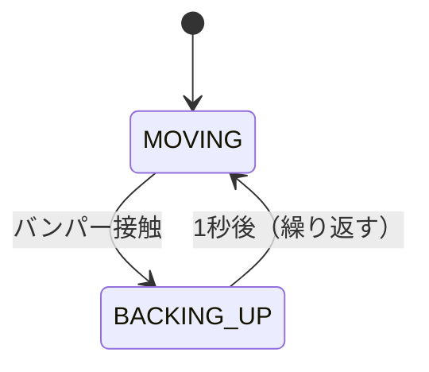

# 16章: Kobuki センサー ── バンパー・崖・オドメトリ

> **注意**: この章の演習でロボットを動かすときは，**常に手でロボットを止められる準備**をしてください．バンパーに当たって停止するまで移動するため，周囲の安全を確認してから実行してください．

---

## Kobuki の主なセンサー

| トピック | メッセージ型 | 内容 |
|---------|------------|------|
| `/mobile_base/events/bumper` | `kobuki_msgs/BumperEvent` | バンパー（正面の接触センサー） |
| `/mobile_base/events/cliff` | `kobuki_msgs/CliffEvent` | 崖センサー（床の有無を検知） |
| `/odom` | `nav_msgs/Odometry` | オドメトリ（位置・姿勢の推定値） |

---

## バンパーセンサー（BumperEvent）

正面の **左・中央・右** の 3 箇所に配置された接触センサーです．

```bash
# バンパーの状態をリアルタイム確認
rostopic echo /mobile_base/events/bumper
```

出力例（何かに当たったとき）：
```
bumper: 1    # 0=LEFT, 1=CENTER, 2=RIGHT
state: 1     # 0=RELEASED, 1=PRESSED
---
```

### メッセージ型の確認

```bash
rosmsg show kobuki_msgs/BumperEvent
```
```
uint8 LEFT=0
uint8 CENTER=1
uint8 RIGHT=2
uint8 RELEASED=0
uint8 PRESSED=1
uint8 bumper
uint8 state
```

### コード例：バンパーの状態を表示するだけ（移動なし）

まずは **移動せずにセンサーを読む** ことから始めましょう．手でバンパーを押してみてください．

`~/catkin_ws/src/kobuki_tutorial/src/bumper_reader.cpp`

```cpp
#include <ros/ros.h>
#include <kobuki_msgs/BumperEvent.h>

void bumperCallback(const kobuki_msgs::BumperEvent::ConstPtr& msg)
{
    std::string pos, state;

    switch (msg->bumper)
    {
        case kobuki_msgs::BumperEvent::LEFT:   pos = "左";   break;
        case kobuki_msgs::BumperEvent::CENTER: pos = "中央"; break;
        case kobuki_msgs::BumperEvent::RIGHT:  pos = "右";   break;
    }

    state = (msg->state == kobuki_msgs::BumperEvent::PRESSED) ? "接触" : "解放";

    ROS_INFO("バンパー [%s] %s", pos.c_str(), state.c_str());
}

int main(int argc, char **argv)
{
    ros::init(argc, argv, "bumper_reader");
    ros::NodeHandle nh;
    ros::Subscriber sub = nh.subscribe("/mobile_base/events/bumper", 10, bumperCallback);
    ROS_INFO("バンパーを手で押してみてください");
    ros::spin();
    return 0;
}
```

---

## 崖センサー（CliffEvent）

底面 3 箇所の赤外線センサーで床の有無を検知します．テーブルの端などで発生します．

```bash
rosmsg show kobuki_msgs/CliffEvent
```
```
uint8 LEFT=0
uint8 CENTER=1
uint8 RIGHT=2
uint8 FLOOR=0
uint8 CLIFF=1
uint8 sensor
uint8 state
uint16 bottom
```

---

## オドメトリ（Odometry）

車輪のエンコーダから **自己位置（x, y）と向き（yaw）** を推定して `/odom` で配信します．

```bash
rostopic echo /odom
```

### オドメトリデータの見方

```yaml
pose:
  pose:
    position:
      x: 0.05    ← 起動時からの X 方向移動距離 [m]
      y: 0.001
    orientation:  ← 向き（クォータニオン形式）
      z: 0.01
      w: 0.999
twist:
  twist:
    linear:
      x: 0.1     ← 現在の速度 [m/s]
```

### ヨー角（向き）の取り出し

向きはクォータニオンで表されています．2D 平面での向き（ヨー角）への変換：

```cpp
const auto& q = msg->pose.pose.orientation;
double yaw = std::atan2(2.0 * (q.w * q.z + q.x * q.y),
                        1.0 - 2.0 * (q.y * q.y + q.z * q.z));
```

> クォータニオンの仕組みは今は理解しなくて大丈夫です．この変換式を使えばヨー角 [rad] が取り出せます．

### コード例：オドメトリを表示するだけ（移動なし）

```cpp
#include <ros/ros.h>
#include <nav_msgs/Odometry.h>
#include <cmath>

void odomCallback(const nav_msgs::Odometry::ConstPtr& msg)
{
    double x = msg->pose.pose.position.x;
    double y = msg->pose.pose.position.y;

    const auto& q = msg->pose.pose.orientation;
    double yaw = std::atan2(2.0 * (q.w * q.z + q.x * q.y),
                            1.0 - 2.0 * (q.y * q.y + q.z * q.z));

    ROS_INFO_THROTTLE(0.5, "位置: (%.4f, %.4f) m  向き: %.3f rad", x, y, yaw);
}

int main(int argc, char **argv)
{
    ros::init(argc, argv, "odom_reader");
    ros::NodeHandle nh;
    ros::Subscriber sub = nh.subscribe("/odom", 10, odomCallback);
    ros::spin();
    return 0;
}
```

> **`ROS_INFO_THROTTLE(秒, ...)`**: 指定した秒間隔でしかログを出しません．毎ループ出力すると多すぎるときに使います．

---

## 演習 3：バンパーに当たったら停止

### 課題

ゆっくり前進し，バンパーが押されたら **即座に停止** するプログラムを書いてください．

壁に向かってゆっくり走らせ，接触した瞬間に止まることを確認します．

### ヒント

- 速度は **0.1 m/s** にすること（壁への衝撃が少ない）
- コールバックとメインループでデータを共有するためのフラグ変数（`bool g_bumper_pressed`）を使う
- 停止コマンドを `publish` してから `break` する

<details>
<summary>サンプルコード（考えてから開くこと！）</summary>

```cpp
#include <ros/ros.h>
#include <geometry_msgs/Twist.h>
#include <kobuki_msgs/BumperEvent.h>

bool g_bumper_pressed = false;

void bumperCallback(const kobuki_msgs::BumperEvent::ConstPtr& msg)
{
    if (msg->state == kobuki_msgs::BumperEvent::PRESSED)
    {
        g_bumper_pressed = true;

        std::string pos;
        switch (msg->bumper)
        {
            case kobuki_msgs::BumperEvent::LEFT:   pos = "左"; break;
            case kobuki_msgs::BumperEvent::CENTER: pos = "中央"; break;
            case kobuki_msgs::BumperEvent::RIGHT:  pos = "右"; break;
        }
        ROS_WARN("バンパー接触！[%s]", pos.c_str());
    }
}

int main(int argc, char **argv)
{
    ros::init(argc, argv, "ex3_bumper_stop");
    ros::NodeHandle nh;

    ros::Publisher cmd_pub =
        nh.advertise<geometry_msgs::Twist>("/mobile_base/commands/velocity", 10);
    ros::Subscriber bumper_sub =
        nh.subscribe("/mobile_base/events/bumper", 10, bumperCallback);

    ros::Duration(1.0).sleep();

    geometry_msgs::Twist cmd;
    ros::Rate rate(10);

    ROS_INFO("前進開始（バンパーに当たったら停止）");

    while (ros::ok())
    {
        if (g_bumper_pressed)
        {
            cmd.linear.x = 0.0;
            cmd_pub.publish(cmd);
            ROS_INFO("停止しました");
            break;
        }

        cmd.linear.x = 0.1;
        cmd_pub.publish(cmd);
        ros::spinOnce();
        rate.sleep();
    }

    return 0;
}
```

</details>

---

## 演習 4：バンパーに当たったら後退して止まる（往復）

### 課題

前進 → バンパー接触 → 後退 → 止まる，を **繰り返す** プログラムを書いてください．

**動作フロー：**



### ヒント

- 状態を `enum State { MOVING, BACKING_UP };` で定義する  
  （`enum` は「名前付き定数のセット」を定義する C++ の機能です．`state == MOVING` のように使えます）
- 「後退」は `linear.x = -0.1`
- 後退時間は 1.0 秒（約 0.1 m）で十分
- バンパーコールバックは **MOVING 状態のときだけ** 状態を変える（二重反応を防ぐ）

<details>
<summary>サンプルコード（考えてから開くこと！）</summary>

```cpp
#include <ros/ros.h>
#include <geometry_msgs/Twist.h>
#include <kobuki_msgs/BumperEvent.h>

bool g_bumper_pressed = false;

void bumperCallback(const kobuki_msgs::BumperEvent::ConstPtr& msg)
{
    if (msg->state == kobuki_msgs::BumperEvent::PRESSED)
        g_bumper_pressed = true;
}

int main(int argc, char **argv)
{
    ros::init(argc, argv, "ex4_bumper_recovery");
    ros::NodeHandle nh;

    ros::Publisher cmd_pub =
        nh.advertise<geometry_msgs::Twist>("/mobile_base/commands/velocity", 10);
    ros::Subscriber bumper_sub =
        nh.subscribe("/mobile_base/events/bumper", 10, bumperCallback);

    ros::Duration(1.0).sleep();

    enum State { MOVING, BACKING_UP };
    State state = MOVING;
    ros::Time state_start = ros::Time::now();

    geometry_msgs::Twist cmd;
    ros::Rate rate(10);

    ROS_INFO("起動．Ctrl+C で終了");

    while (ros::ok())
    {
        double elapsed = (ros::Time::now() - state_start).toSec();

        switch (state)
        {
            case MOVING:
                cmd.linear.x = 0.1;
                if (g_bumper_pressed)
                {
                    g_bumper_pressed = false;
                    state = BACKING_UP;
                    state_start = ros::Time::now();
                    ROS_INFO("接触 → 後退");
                }
                break;

            case BACKING_UP:
                cmd.linear.x = -0.1;
                if (elapsed > 1.0)
                {
                    state = MOVING;
                    state_start = ros::Time::now();
                    ROS_INFO("後退完了 → 前進");
                }
                break;
        }

        cmd_pub.publish(cmd);
        ros::spinOnce();
        rate.sleep();
    }

    return 0;
}
```

</details>

---

## 演習 5：オドメトリで指定距離だけ移動して戻る

### 課題

オドメトリを使って **指定距離だけ前進し，同じ距離だけ後退して元の位置に戻る** プログラムを書いてください．

```bash
# 0.05 m 前進して戻る
rosrun kobuki_tutorial ex5_odom_move 0.05
```

> 推奨は **0.1 m** 以下です．

### ヒント

- `/odom` をサブスクライブして現在位置 `(x, y)` を取得する
- 走行距離の計算：`distance = sqrt((x - start_x)² + (y - start_y)²)`（`#include <cmath>` が必要）
- 前進フェーズと後退フェーズで `start_x, start_y` をそれぞれリセットする

<details>
<summary>サンプルコード（考えてから開くこと！）</summary>

```cpp
#include <ros/ros.h>
#include <geometry_msgs/Twist.h>
#include <nav_msgs/Odometry.h>
#include <cmath>
#include <string>

double g_x = 0.0, g_y = 0.0;
bool   g_odom_received = false;

void odomCallback(const nav_msgs::Odometry::ConstPtr& msg)
{
    g_x = msg->pose.pose.position.x;
    g_y = msg->pose.pose.position.y;
    g_odom_received = true;
}

// 指定距離だけ移動する（正なら前進，負なら後退）
void moveDist(ros::Publisher& pub, double target_dist)
{
    geometry_msgs::Twist cmd;
    cmd.linear.x = (target_dist > 0) ? 0.1 : -0.1;

    double start_x = g_x;
    double start_y = g_y;
    double traveled = 0.0;
    ros::Rate rate(10);

    while (ros::ok() && traveled < std::abs(target_dist))
    {
        ros::spinOnce();
        double dx = g_x - start_x;
        double dy = g_y - start_y;
        traveled = std::sqrt(dx*dx + dy*dy);

        ROS_INFO_THROTTLE(0.5, "走行: %.4f / %.4f m", traveled, std::abs(target_dist));
        pub.publish(cmd);
        rate.sleep();
    }

    cmd.linear.x = 0.0;
    pub.publish(cmd);
    ros::Duration(0.5).sleep();
}

int main(int argc, char **argv)
{
    ros::init(argc, argv, "ex5_odom_move");

    if (argc < 2)
    {
        ROS_ERROR("使い方: ex5_odom_move <距離[m]>  ※ 最大 0.1 m");
        return 1;
    }
    double dist = std::stod(argv[1]);
    if (dist > 0.1)
    {
        ROS_WARN("%.3f m は大きな値です．0.1 m 以下を推奨します", dist);
    }

    ros::NodeHandle nh;
    ros::Publisher cmd_pub =
        nh.advertise<geometry_msgs::Twist>("/mobile_base/commands/velocity", 10);
    ros::Subscriber odom_sub =
        nh.subscribe("/odom", 10, odomCallback);

    ros::Duration(1.0).sleep();

    while (ros::ok() && !g_odom_received)
    {
        ros::spinOnce();
        ros::Duration(0.1).sleep();
    }

    ROS_INFO("前進: %.4f m", dist);
    moveDist(cmd_pub, dist);

    ROS_INFO("後退: %.4f m", dist);
    moveDist(cmd_pub, -dist);

    ROS_INFO("完了！元の位置に戻りました");
    return 0;
}
```

</details>

---

## CMakeLists.txt（この章全体分）

```cmake
add_executable(bumper_reader        src/bumper_reader.cpp)
target_link_libraries(bumper_reader        ${catkin_LIBRARIES})

add_executable(odom_reader          src/odom_reader.cpp)
target_link_libraries(odom_reader          ${catkin_LIBRARIES})

add_executable(ex3_bumper_stop      src/ex3_bumper_stop.cpp)
target_link_libraries(ex3_bumper_stop      ${catkin_LIBRARIES})

add_executable(ex4_bumper_recovery  src/ex4_bumper_recovery.cpp)
target_link_libraries(ex4_bumper_recovery  ${catkin_LIBRARIES})

add_executable(ex5_odom_move        src/ex5_odom_move.cpp)
target_link_libraries(ex5_odom_move        ${catkin_LIBRARIES})
```

---

[→ 17章: クラスを使った Kobuki プログラミング](17_kobuki_class.md)
